## Entrega Semana 4

 1. Promedio de Goles por década/10- Tendencia de Goles por Década

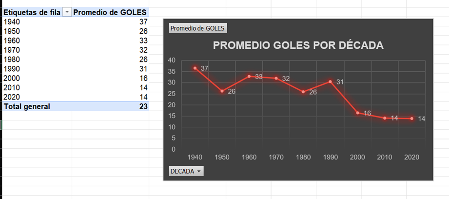
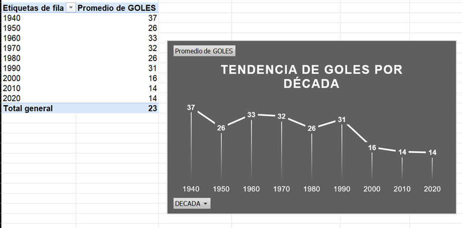
Aunque ambos gráficos muestran los mismos datos, mantienen un enfoque distinto. El primero muestra el Promedio de Goles por década, mientras el segundo muestra la Tendencia de Goles por década. Esto se refiere a que el primero se enfoca en mostrar los datos en intervalos específicos de tiempo con el fin de que la tendencia general pueda ser identificada; mientras que el segundo, muestra esa tendencia histórica de goles hasta la actualidad y nos otorga las bases para desarrollar una predicción del desarrollo de los datos a futuro.

2. 15- Participación histórica del Cúcuta Deportivo

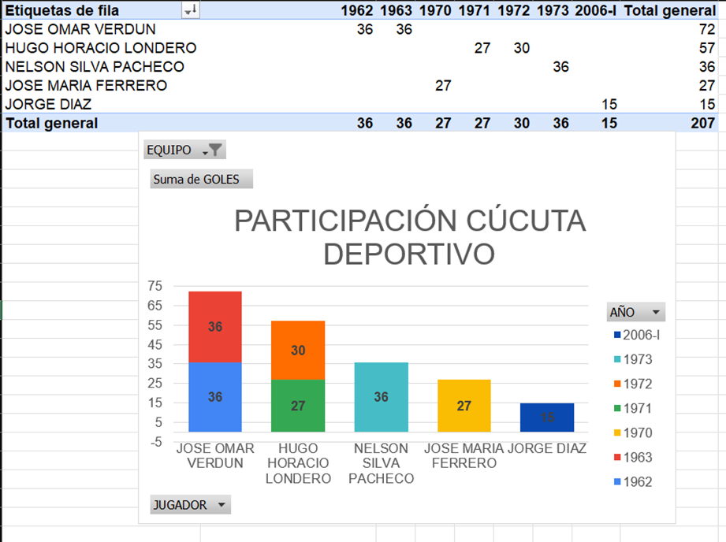
En esta gráfica se expone la Participación histórica del equipo “Cúcuta Deportivo” a partir de la suma de goles de sus jugadores en distintos periodos de tiempo. 2 de los jugadores destacaron en temporadas distintas, pero son temporadas consecutivas.

3. 24- Suma de Goles por equipo organizado de mayor a menor

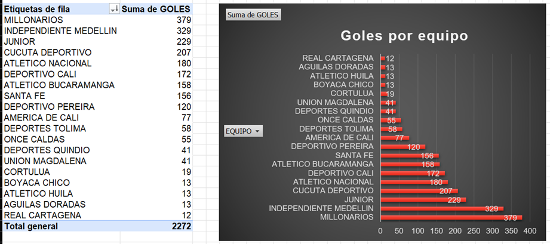
En la presente gráfica se muestra en su totalidad los equipos ordenados de mayor a menor frente a la sumatoria de la cantidad de goles anotados dentro de los ganadores de cada temporada desde el año 1948 hasta la actualidad.

4. 32- Historia Gráfica de Medellín

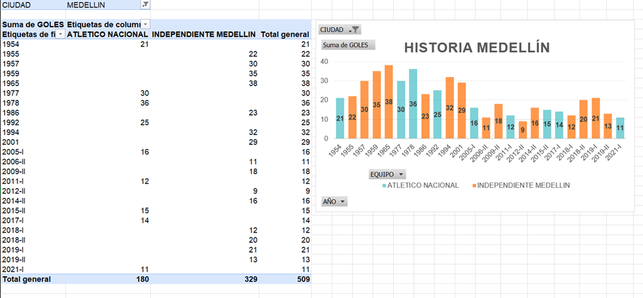
En este punto se muestra la Historia futbolística de la ciudad de Medellín, por medio de la participación histórica y la sumatoria de goles anotados en las temporadas en las que alguno de sus dos equipos de fútbol fue denominado campeón del torneo.

5. 16- Colombia vs el Mundo

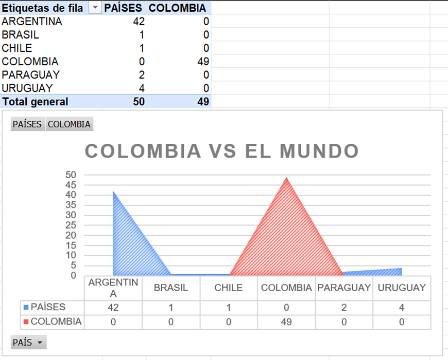
Esta grafica muestra la participación y el desempeño histórico entre los jugadores colombianos y extranjeros como máximos goleadores y, por ende, ganadores de cada uno de los torneos.

6. 33- Historia de los Torneos Cortos en Goles

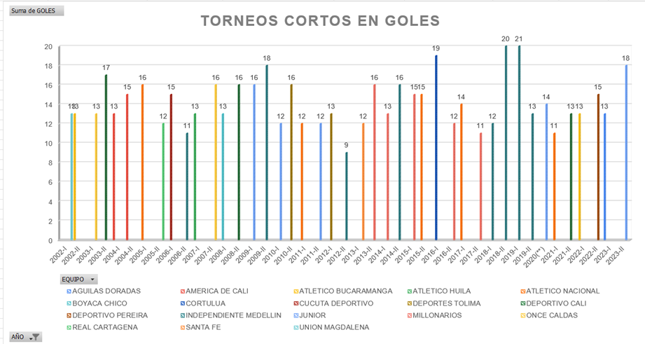
Desde el año 2002 se empezaron a aplicar los “Torneos Cortos”. Esto se refiere a que, de forma anual, se desarrollan 2 torneos (1 cada semestre) en vez de 1. En este gráfico, se muestra la historia de esos “Torneos Cortos” en base a los equipos ganadores y la cantidad de goles anotados.

7. 25- Goles por Equipo

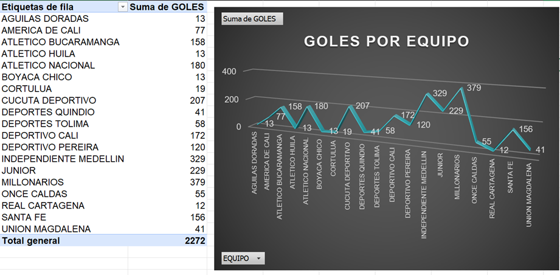
Esta gráfica muestra la sumatoria histórica de los goles anotados por cada equipo en todos los torneos en los que ha sido ganador.

8. 7- Promedio de Goles por Ciudad

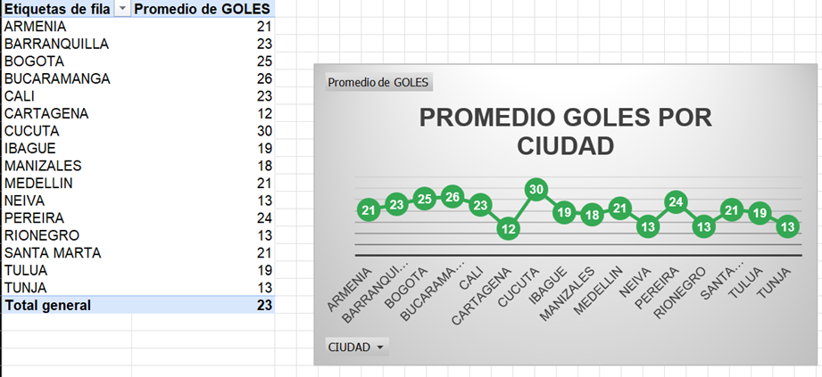
Esta gráfica muestra el promedio histórico de goles realizados por ciudad que haya sido campeona en cada torneo realizado.

9. Top 10 goleadores de Millonarios

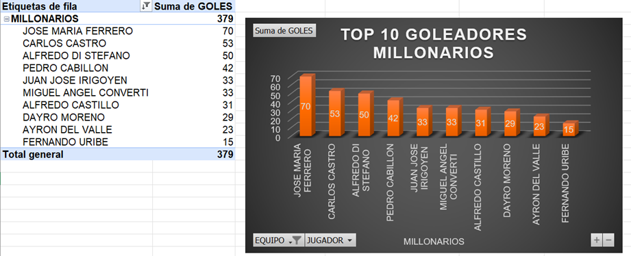
Esta gráfica muestra el Top 10 de los goleadores históricos del equipo de fútbol conocido como Millonarios. Está organizado de acuerdo con la sumatoria total de goles de cada jugador, discriminando únicamente a los 10 mejores. 

10. 23- Top 10 de goeadores históricos

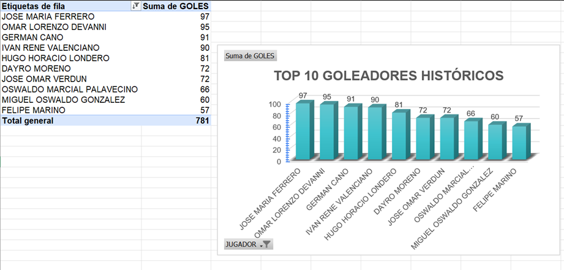
Esta gráfica muestra el Top 10 de los goleadores históricos a nivel general dentro del torneo. Está organizado de acuerdo con la sumatoria total de goles de cada jugador, discriminando únicamente a los 10 mejores.