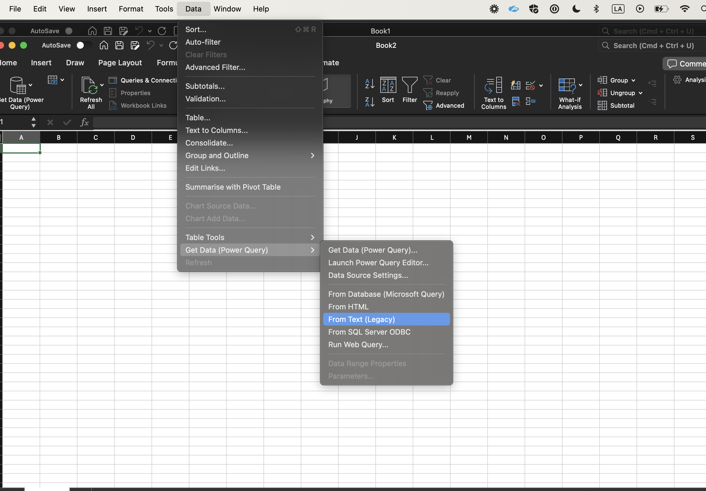
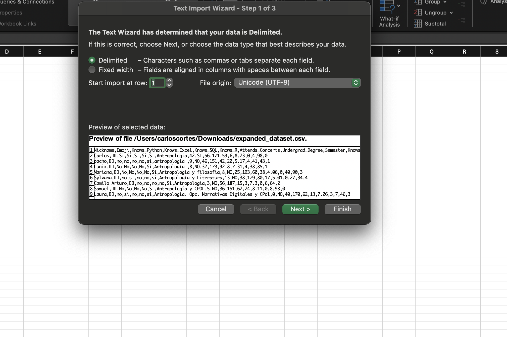
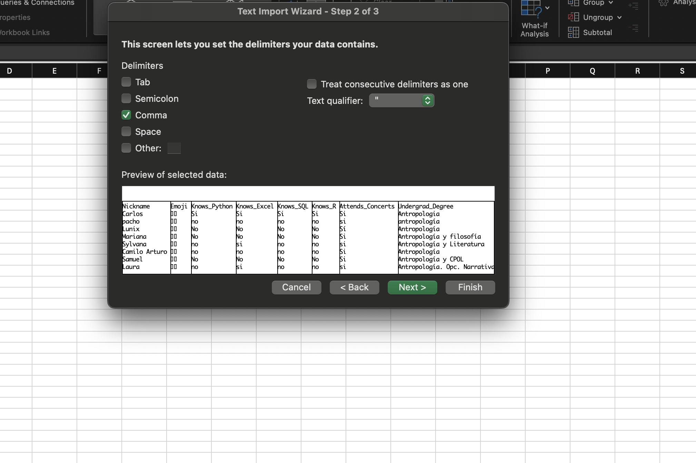
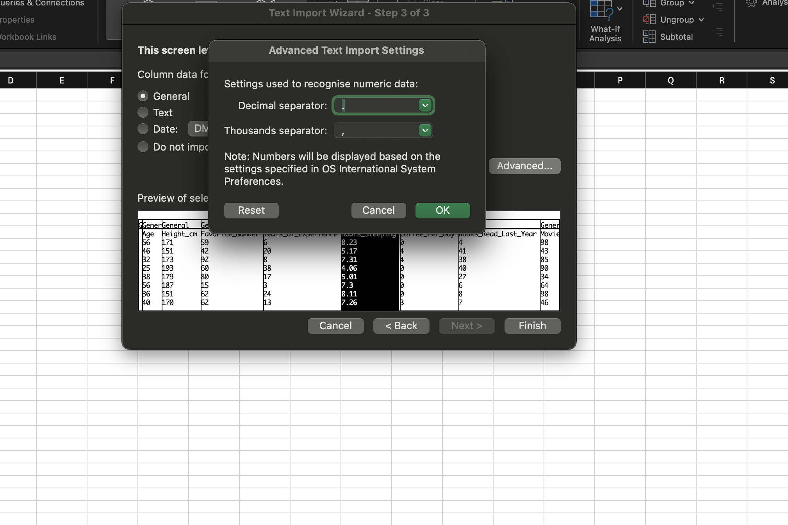

# Hojas de Cálculo y formatos planos

## ¿Qué es? 
Una hoja de cálculo es una herramienta informática que permite organizar, analizar y manipular datos de manera tabular. Consiste en una cuadrícula de celdas, donde cada celda puede contener datos, fórmulas, funciones o formatos específicos. Existen muchas formas de hojas de cálculo,  Google Sheets y Microsoft Excel son lo mas usados por todo tipo de usuario

## ¿Qué no es?

La principal diferencia entre una hoja de cálculo y una base de datos radica en su estructura y funcionalidad:

- Estructura de datos: En una hoja de cálculo, los datos se organizan en una cuadrícula bidimensional de filas y columnas, similar a una tabla. En una base de datos, los datos se organizan en tablas relacionadas entre sí, utilizando un modelo de datos relacional o no relacional.

- Capacidad de almacenamiento y escalabilidad: Las hojas de cálculo están limitadas por la cantidad de datos que pueden contener y pueden volverse difíciles de manejar a medida que crece la cantidad de información. Las bases de datos están diseñadas para manejar grandes volúmenes de datos y pueden escalar para satisfacer las necesidades de almacenamiento de una organización en crecimiento.

- Integridad y seguridad de los datos: Las bases de datos ofrecen mecanismos para garantizar la integridad y la seguridad de los datos, como la aplicación de restricciones de integridad referencial y la implementación de permisos de acceso. Las hojas de cálculo suelen carecer de estas capacidades, lo que las hace más susceptibles a errores y vulnerabilidades de seguridad.

## Implicaciones

>But its default settings were designed with more mundane applications in mind, so when a user inputs a gene’s alphanumeric symbol into a spreadsheet, like MARCH1 — short for “Membrane Associated Ring-CH-Type Finger 1” — Excel converts that into a date: 1-Mar.

[Fuente](https://www.theverge.com/2020/8/6/21355674/human-genes-rename-microsoft-excel-misreading-dates)

## Interface de Usuario

- Barra de herramientas: Contiene botones para realizar acciones comunes, como guardar, imprimir y copiar.
- Barra de fórmulas: Muestra la fórmula o el valor de la celda activa. Accedemos desde las celdas utilizando < =,+ o ->
- Celdas: Espacios individuales en la hoja de cálculo donde puedes ingresar datos o fórmulas.
- Hoja de cálculo: Donde se ingresan y organizan los datos en celdas.
- Columnas y filas: Etiquetadas con letras (columnas) y números (filas) para identificar cada celda de manera única.

### Fórmulas y Funciones

*Fórmulas*: Expresiones matemáticas que realizan cálculos en los datos de las celdas.
>Por ejemplo, < =A1+B1 > suma los valores de las celdas A1 y B1.
*Funciones*: Fórmulas predefinidas que realizan cálculos específicos.
>Por ejemplo, < =SUM(A1:A10)> suma los valores de las celdas A1 a A10.

### Formulas útiles para limpieza de datos

#### Separar datos por columnas

Selecciona las Celdas: Primero, selecciona las celdas que contienen el texto que deseas separar. Puede ser una única celda, un grupo de celdas contiguas o una columna entera.

- Accede a Texto en Columnas: Ve a la pestaña "Datos" en la cinta de opciones de Excel. Haz clic en "Texto en columnas", que se encuentra en el grupo "Herramientas de datos".

- Elige el Tipo de Datos: Se abrirá el asistente para convertir texto en columnas. En el primer paso, selecciona si tu texto es "Delimitado" (por ejemplo, separado por comas, espacios, etc.) o "Ancho fijo" (donde deseas dividir el texto en columnas en ubicaciones fijas). Haz clic en "Siguiente".

- Establece los Delimitadores: Si elegiste texto "Delimitado", ahora debes especificar qué delimitadores usa tu texto (por ejemplo, comas, espacios, tabulaciones, etc.). Marca las casillas correspondientes a tus delimitadores y haz clic en "Siguiente".







> En español un numero se dice 4 coma 9, mientras que en inglés es 4 punto 9



#### Estandarización

1. TRIM

La función TRIM elimina los espacios en blanco adicionales alrededor de un texto, lo que es útil para limpiar datos que pueden contener espacios innecesarios.

```
=ESPACIOS(texto)
```


2. MINUSC

La función MINUSC convierte texto a minúsculas, lo que es útil para estandarizar la capitalización del texto en una columna.

```
=MINUSC(texto)
```


3. MAYUSC

La función MAYUSC convierte texto a mayúsculas, lo que es útil para estandarizar la capitalización del texto en una columna.

```
=MAYUSC(texto)
```

4. NOMPROPIO

La función NOMPROPIO convierte el primer carácter de cada palabra en un texto en mayúscula y el resto en minúsculas. Es útil para formatear correctamente nombres y títulos.

```
=NOMPROPIO(texto)
```

5. CONCATENAR

Estas funciones permiten concatenar o unir texto de diferentes celdas en una sola celda. Son útiles para combinar datos de múltiples columnas en un formato específico.

```
=CONCATENAR(texto1, texto2, ...)
```

6. IZQUIERDA, DERECHA y EXTRAE

Estas funciones extraen partes de un texto basado en su posición. IZQUIERDA extrae caracteres desde el inicio del texto, DERECHA desde el final y EXTRAE desde una posición específica.

```
=IZQUIERDA(texto, num_caracteres)
=DERECHA(texto, num_caracteres)
=EXTRAE(texto, inicio, num_caracteres)
```

7. SUSTITUIR

La función SUSTITUIR reemplaza una parte de un texto con otro texto especificado. Es útil para reemplazar caracteres no deseados o corregir errores en los datos.

```
=SUSTITUIR(texto, texto_a_reemplazar, nuevo_texto)
```

8. LIMPIAR

La función LIMPIAR elimina todos los caracteres no imprimibles del texto, lo que puede ser útil para limpiar datos que contienen caracteres invisibles.

```
=LIMPIAR(texto)
```

9. Separar columnas

[Tutorial de nombres](https://support.microsoft.com/es-es/office/dividir-texto-en-columnas-diferentes-con-funciones-49ec57f9-3d5a-44b2-82da-50dded6e4a68
)

10. Quitar acentos o como anidar funciones

Este ejemplo solo reemplaza las tildes de las vocales minúsculas. Deberías añadir más funciones SUSTITUIR para cubrir mayúsculas y otras letras con tildes.

```
=SUSTITUIR(SUSTITUIR(SUSTITUIR(SUSTITUIR(SUSTITUIR(A1, "á", "a"), "é", "e"), "í", "i"), "ó", "o"), "ú", "u")
```


