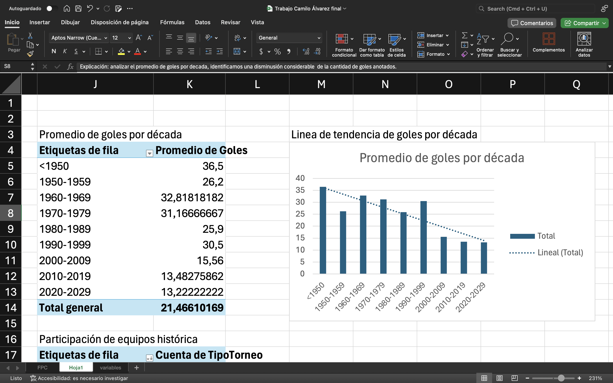

1. Promedio de goles por década: Elabore una tabla dinámica con las variables de la época en donde abarca 9 años para conformar las décadas, junto a esto hice una gráfica. Esto nos demostró que la la cantidad de goles descendió considerablemente. Una hipótesis es que la calidad de juego mejoro, por lo que hacer goles se vuelve una tras mucho mas compleja.

2. Participación de equipos históricamente: Elabore una tabla dinámica en donde en donde las filas están los equipos, acá no están todos del ppc, sino lo mas relevantes por sus figuras y campañas. En esta tabla millonarios es el equipo con mas participaciones. En esta misma tabla encontramos que el total general de las participaciones dd los equipos que forman esta tabla es 118.
3. Top 10 goleadores históricos: Acá quería resaltar la dominancia del verdadero pichichi del F, don Dayro Moreno. Mi tabla dinámica recolecto basado en sus filtros los nombres de los principales goleadores basado en su participación y goles en la primera tabla limpiada. La tabla omite variables como todas las campañas en la que han jugado estos top 10 jugadores, pero de igual manera demostró que dallo es el único jugador con corona de rey en el ppc.
4. Suma de goles por equipo organizados de menor a mayor: esta tabla dinámica recolecta los equipos que se encuentran en la primera tabla, académica esta organizado con los filtro de la tabla dinámica, en donde esta los equipos y la suma de goles que hay datados en la tabla. Estas variables demostraron que el equipo con menos goles es Real Cartagena y que Millonarios es el equipo con mas goles acumulados.
5. Suma de goles por equipo: Realizando la recolección de datos basados en las principales variable encontradas en la tabla principal, elabore una tabla dinámica que recolecte los equipos que están. También la suma de los goles basados en la participación de equipos, académicos no hay orden, pero leyendo la tabla encontramos que millonarios y el Dim son los equipos con mas goles.
6. Promedio de goles por ciudad: En esta tabla dinámica recolecte las variables como al ciudad, acá se recolectaron las ciudades que participaron en la tabla limpia que Carlos nos dio. Se saco un promedio y se mostró que Bucaramanga es la ciudad con el promedio mas alto de goles.
7. Conteo de torneos por década: En esta tabla dinámica recolecte los equipos en relación al tipo de toreo y periodo, empece las décadas como en la tabla de goleadores y de paso elabore una gráfica. La gráfica elaborada demostró qu ele tipo ha hecho que se incremente la cantidad de torneos, esto puede suponer una mayor exigencia en el FPC.
8. Máximo de goles por equipo: En esta tabla recolecte los equipos que aparecen y recolecta la cantidad de goles de sus jugadores en relación a sus equipos. La tabla se organizo de orden a menor, el equipo con mas goles es millonarios y el equipo con menos goles anotados es la equidad y real cartagena.
9. Mínimo número de goles por equipo: Esta tabla recolecta la cantidad mas baja de goles por los equipos que participan, estas variables participan basadas en los goleadores que representan su equipo. Por esto mismo, junto a la gráfica elaborada demuestra que cortulua es el equipo con la mayor cantifdad. Esto sucede ya que la tabla dinámica lee solos las variables recolectadas. Cortulua solo ha tenido un goleador y por eso el único valore registrado son los 19 tantos anotados en el 2016 por Miguel Angel Borja 😆😆
