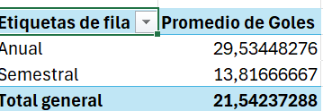

Hola.
Adjunto algunas cositas.

1. La tabla mía limpiada por mi propia mano:

2. Promedio de goles por decada:

Lo que esta tabla y gráfica nos dicen es que el promedio de goles por decada va descendiendo. Aunque antes de los años 2000 se mantiene un promedio más o menos similar, en las decadas de 2000, 2010, y 2020 baja significativamente, lo cual puede responder en primer lugar a una duración más corta de los torneos, debido a que ahora hay dos torneos de la mitad de longitud al año. Esto puede reflejar que quizás el promedio de goles por año no ha bajado, sino que al cortar los torneos a la mitad del tiempo, al hacerlo también reducen el promedio de goles significativamente.

3. Promedio de goles por torneo:

Acá se refljea y se trata de explicar lo que aparecía antes. Esta tabla permite ver que el promedio de goles cuando los torneos eran de año completo era de 29.5, mientras que en los torneos semestrales es de 13.8. 13.8 es la mitad de 27.6, lo cual significa que aunque los torneos semestrales si redujeron la cantidad de goles a casi la mitad del promedio de los torneos anuales, igual hubo una disminución en el promedio de goles al año. Esto puede responder a varios factores, entre ellos la suma de unas pausas entre torneos que pueden permitir esta reducción en el promedio.

4. Top 10 goleadores de Millonarios:

Esta tabla refleja los top 10 jugadores con más goles de la historia de Millonarios en el FPC. Se puede ver que ninguno de los top 3 toma lugar en los torneos cortos, sino que todos toman lugar en los torneos anuales. Esto puede reflejar una crisis que atravesó Millonarios en los años pasados, tanto en terminos futbolisticos como economicos, la cual hasta ahora se esta comenzando a recuperar con el proceso de Alberto Gamero. Esta crisis pudo haber evitado que jugadores de gran calibre como Alfredo di Stefano participaran en estos torneos por parte de Millonarios.

5. Historia de los torneos cortos:

Esta tabla permite ver lo mencionado anteriormente en los puntos 2 y 3. A medida que se estandarizaron los torneos cortos semestrales hubo una disminución en el promedio de goles comparado con aquellos de los años previos a la decada de los dos mil, pero una vez se estandarizan el promedio de goles se mantiene relativamente estable, aunque descendiendo de manera muy ligera. Esto puede responder a un deterioro en la calidad del fútbol colombiano por la prioritización del dinero por sobre la calidad que le han dado los administradores de la liga en el país.