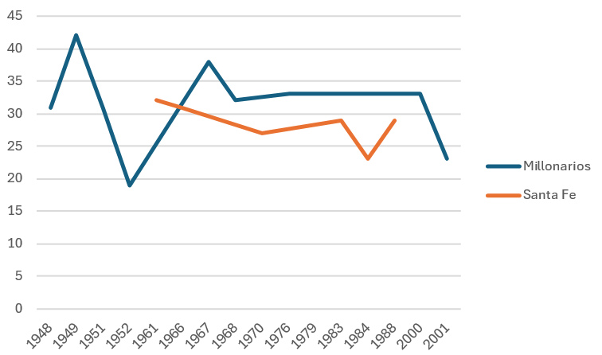
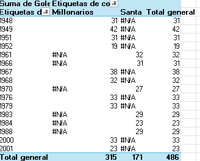

Hola, adjunto las cinco preguntas que me faltaban de la entrega pasada

6. Historia gráfica de Bogotá:
Este gráfico indica que tanto Millonarios como Santa Fe han mostrado un alto nível de fútbol a nível de los torneos anuales. Los torneos semestrales no se tomaron en cuenta debido a que no se considera que sean comparables con los torneos anuales. Sin embargo, en el gráfico también se nota que la historia de Millonarios es más destacada que la de Santa Fe. La línea de Millonarios muestra que han tenido más goleadores historicos que Santa Fe, y también que los goleadores historicos de Millonarios en general han destacado con más goles que los de Santa Fe. Esto se puede deber a una mayor inversión monetaria, lo cual lleva a mejores tecnicos y jugadores, o también se puede deber a una simple superioridad en calidad futbolistica por parte de Millonarios.

7. Historia gráfica de Medellín
En primer lugar es importante decir que por la misma razón que en el punto pasado se van a ignorar los torneos cortos semestrales. En primer lugar, se puede evidenciar en la gráfica que hay un muy buen record de ambos equipos en los torneos del FPC, sin embargo, también se puede evidenciar que tuvieron picos distintos en terminos de goles, debido a que mientras que el pico de goles del DIM fue alrededor de la decada de los 50s, el pico del Nacional fue alrededor de los finales de los 80s y comienzos de los 90s. Sin embargo, hacia la decada de los 2000 se puede evidenciar que se esta revirtiendo esta tendencia, con una subida en goles del DIM, y una baja de goles del Nacional. Esto puede ser el resultado del comienzo y el final de ciclos de importantes entrenadores en ambos equipos, igual que también puede ser el reflejo de los cambios sociales que ocurrieron en Medellín en esta epoca, y como estos llevaron a factores economicos que afectaron a los equipos.

8. Conteo de goleadores por equipi
En esta gráfica se puede ver que hay un gran número de goleadores en los equipos que corresponden a las grandes capitales del país, en particular Bogotá, Medellín, y Barranquilla. Esto puede ser debido a que al estar en centros economicos hay mayor posibilidad de generar un crecimiento estable de los equipos, y también se mantienen fuertes e importantes hinchadas que le dan apoyo constante a los equipos. Es notable la ausencia de los equipos caleños, los cuales se acercan más a la media. Esto puede ser debido a irregularidades con los dueños, los jugadores, o los entrenadores de los equipos, igual que por las condiciones socioeconomicas de la ciudad.
[GoleadoresxEquipo](image-10.png)

9. Conteo de torneos por decada
Se puede ver en esta gráfica que hay un aumento importante de torneos entre las decadas de 1940 y 1950, lo cual se debe posiblemente a que se formalizo y profesionalizo el FPC en este momento de la historia. Por las siguientes cinco decadas el número de torneos se mantiene estable, con diez en cada decada (una por año), y luego hay una drastica subida en las decadas 2000 y 2010, ya que se empezaron a tener torneos cortos. Finalmente, la decada del 2020 será excluida debido a que al solo haber unos pocos años en registro, no son datos confiables todavía. En las decadas 1960, 1970, 2000, y 2010 hay más torneos que los que debería haber debido a que hay años en los cuales se presenta más de un botín de oro, por lo consiguiente, el torneo se repite.

10. Historia gráfica del Bucaramanga
En este gráfico se puede ver que el Bucaramanga tuvo su pico goleador alrededor de la decada de 1980. A su vez, se puede ver que la cantidad de goles del Bucaramanga disminuye drasticamente con el comienzo de los torneos cortos en la decada de los 2000, debido a que se duplican la cantidad de torneos en la misma cantidad de tiempo. El pico de Bucaramanga en los años de 1980 se puede deber al legendario equipo de Bucaramanga de 1984, gracias a la colaboración del empresario Carlos Ardila Lule
