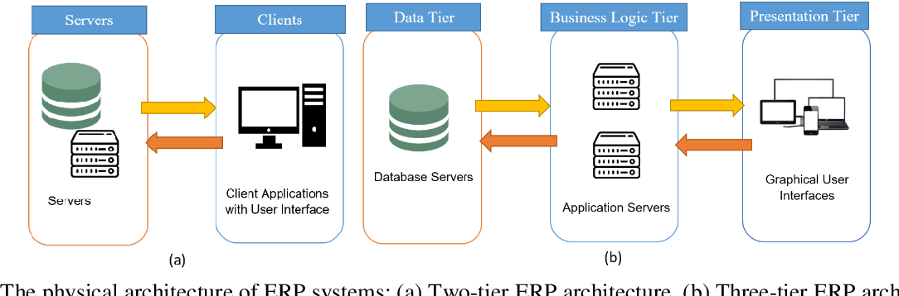
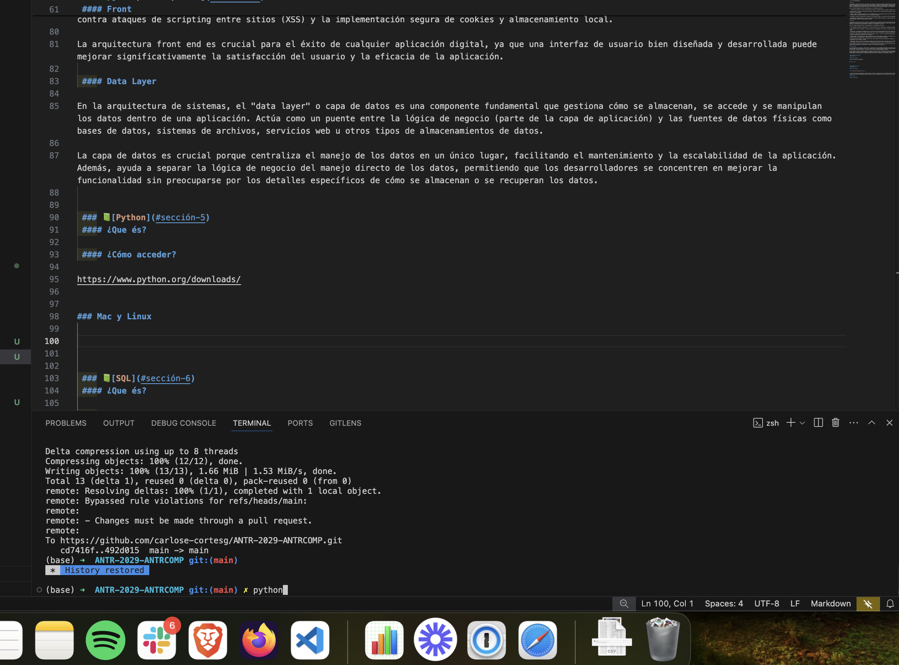
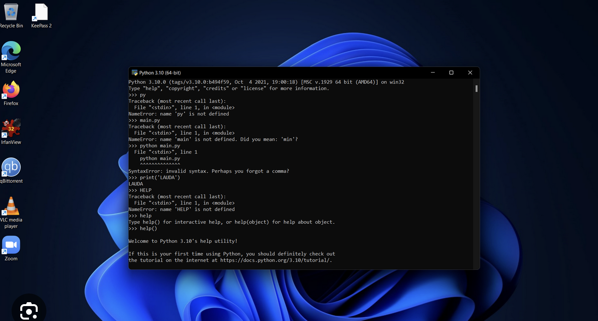
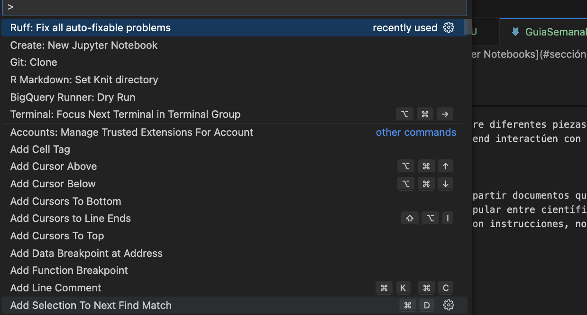

# Semana 4

## Intro a Python


#### Tabla de Contenido
- [Objetivo Semanal](#sección-1)
- [Metas Semanales](#sección-2)
- [Uso del análisis computacional en Ciencias Sociales](#sección-3)
- [Back, Front, Data](#sección-4)
- [Python](#sección-5)
- [Jupyter Notebooks](#sección-6)

	
### 📈[Objetivo Semanal](#sección-1)

Perderle miedo a Python

### 📗[Metas Semanales](#sección-2)
 - [ ] Entender que es un lenguaje de programación
 - [ ] Entender que es back, front, data layer
 - [ ] Entender que es sql
 - [ ] Utilizar un jupyter notebook


 ### 📗[Entrega 2 y 3 Semana](#sección-3)
 - Carpeta en Semana 4, con su nombre 
- 9 preguntas + 1 (la obligatoria) -> por lo menos 3 gráficos
    - Interpretación del gráfico o la dínamica
- Formulación BuscarH y BuscarV
- Entrega en 8 días


 ### 📗[Uso del análisis computacional en Ciencias Sociales](#sección-4)
 -  [Tasas de Fertilidad Global](https://www.visualcapitalist.com/cp/charted-rapid-decline-of-global-birth-rates/)

 ### 📗[Back, Front, Data](#sección-5)
 #### Arquitectura de Sistemas Modernos

Neologismos que explican cómose

 

 #### Back

La arquitectura back end se refiere a la estructura y diseño de la parte del sistema de software que el usuario final no ve directamente. Esta arquitectura incluye servidores, bases de datos, aplicaciones y la lógica de negocio necesaria para que la aplicación funcione correctamente. Es esencial para el funcionamiento de las aplicaciones web y móviles, dado que gestiona el almacenamiento y procesamiento de datos, así como la implementación de las reglas y procedimientos que definen cómo interactúa la aplicación con los datos del usuario y otros servicios.

Aquí hay algunos componentes clave y consideraciones de la arquitectura back end:

-  *Servidores*: Máquinas o entornos virtuales donde se ejecuta el código del lado del servidor. Pueden ser locales o alojados en la nube.

- *Bases de datos* : Sistemas utilizados para almacenar y gestionar datos. Las bases de datos pueden ser relacionales (como MySQL o PostgreSQL) o no relacionales (como MongoDB).

- *Lógica de negocio*: Código que define reglas y procedimientos que la aplicación necesita para operar correctamente, incluyendo el manejo de la entrada y salida de datos, operaciones matemáticas, y otras funciones esenciales.

- *Seguridad*: Incluye la autenticación, autorización, encriptación de datos, y protección contra vulnerabilidades y ataques.

- *Escalabilidad y Mantenibilidad*: La arquitectura debe ser capaz de manejar aumentos en la carga de trabajo y facilitar la actualización y mantenimiento del software sin interrumpir el servicio.

 #### Front

La arquitectura front end se refiere al diseño y la estructura de la interfaz de usuario de una aplicación web, móvil o de escritorio, que es la parte visible con la que interactúan los usuarios. El objetivo de la arquitectura front end es proporcionar una experiencia de usuario agradable, eficiente e intuitiva, facilitando la interacción entre el usuario y la aplicación o sitio web.

Aquí están algunos componentes clave y consideraciones en la arquitectura front end:

- *HTML (Lenguaje de Marcado de Hipertexto)*: Es la base estructural de las páginas web, utilizado para organizar y dar formato al contenido.

- *CSS (Hojas de Estilo en Cascada)*: Se usa para controlar la presentación, el formato y el diseño de los documentos HTML, incluyendo colores, fuentes y layouts.

- *JavaScript*: Un lenguaje de programación que se utiliza para crear interactividad dentro de las páginas web. Puede manipular elementos HTML y CSS, realizar operaciones matemáticas, manejar eventos (como clics o teclas presionadas), y comunicarse con servidores.

- *Frameworks y Bibliotecas*: Herramientas como React, Angular, Vue.js, y otros que proporcionan componentes reutilizables y patrones de diseño para facilitar el desarrollo de interfaces ricas y dinámicas.

- *Responsividad y Accesibilidad*: El diseño debe adaptarse a diferentes tamaños de pantalla y dispositivos, garantizando que todos los usuarios, incluidos aquellos con discapacidades, puedan acceder y utilizar la aplicación efectivamente.

- *Optimización de Rendimiento*: Incluye técnicas como la minificación de código, optimización de imágenes, y carga diferida de recursos para hacer que la aplicación sea más rápida y eficiente.

- *Seguridad*: Aunque el front end no maneja directamente los datos sensibles como el back end, aún así se deben considerar aspectos como la protección contra ataques de scripting entre sitios (XSS) y la implementación segura de cookies y almacenamiento local.

La arquitectura front end es crucial para el éxito de cualquier aplicación digital, ya que una interfaz de usuario bien diseñada y desarrollada puede mejorar significativamente la satisfacción del usuario y la eficacia de la aplicación.

 #### Data Layer

En la arquitectura de sistemas, el "data layer" o capa de datos es una componente fundamental que gestiona cómo se almacenan, se accede y se manipulan los datos dentro de una aplicación. Actúa como un puente entre la lógica de negocio (parte de la capa de aplicación) y las fuentes de datos físicas como bases de datos, sistemas de archivos, servicios web u otros tipos de almacenamientos de datos.

La capa de datos es crucial porque centraliza el manejo de los datos en un único lugar, facilitando el mantenimiento y la escalabilidad de la aplicación. Además, ayuda a separar la lógica de negocio del manejo directo de los datos, permitiendo que los desarrolladores se concentren en mejorar la funcionalidad sin preocuparse por los detalles específicos de cómo se almacenan o se recuperan los datos.


 ### 📗[Python](#sección-5)
 #### ¿Que és?

Python es un lenguaje de programación de alto nivel, interpretado y de propósito general, conocido por su fácil lectura y sintaxis clara. Fue creado por Guido van Rossum y lanzado por primera vez en 1991. Python es un lenguaje muy popular, utilizado en una variedad de aplicaciones, desde desarrollo web hasta ciencia de datos y aprendizaje automático. 

 #### ¿Cómo acceder?

https://www.python.org/downloads/


##### Mac y Linux



##### Windows




  ### 📗[Jupyter Notebooks](#sección-7)


- *APIs (Interfaces de Programación de Aplicaciones)*: Permiten la comunicación entre diferentes piezas de software de manera estandarizada. Son esenciales para integrar diferentes sistemas y permitir que las aplicaciones front end interactúen con el back end.

 #### ¿Que és?

Un Jupyter Notebook es una aplicación web de código abierto que permite crear y compartir documentos que contienen código en vivo, ecuaciones, visualizaciones y texto narrativo. Utiliza una interfaz basada en web que es muy popular entre científicos de datos, investigadores, educadores y desarrolladores por su capacidad para combinar ejecución de código en tiempo real con instrucciones, notas y otros contenidos.

 #### ¿Cómo acceder?

1. 

 ```
pip install jupyterlab
```

2. Abrir un jupyter notebook



3. Voila!