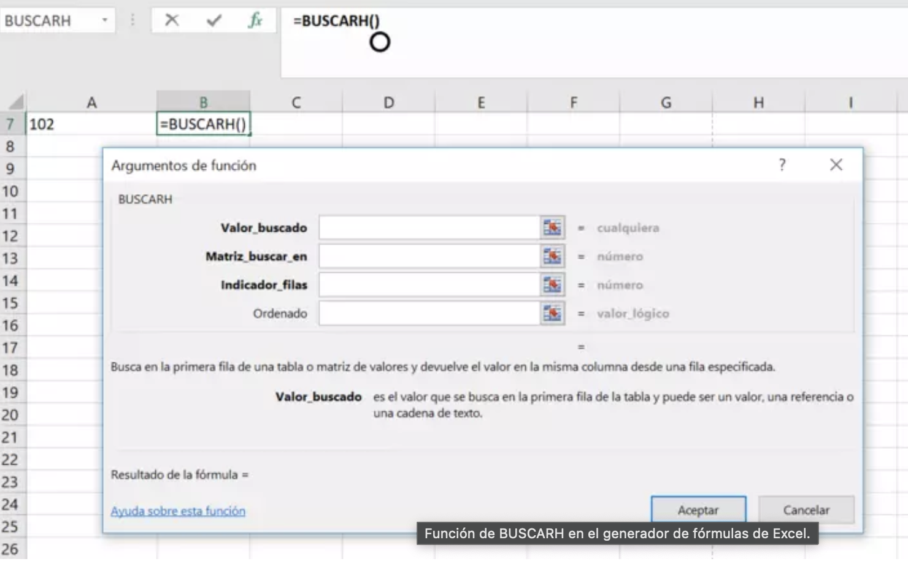
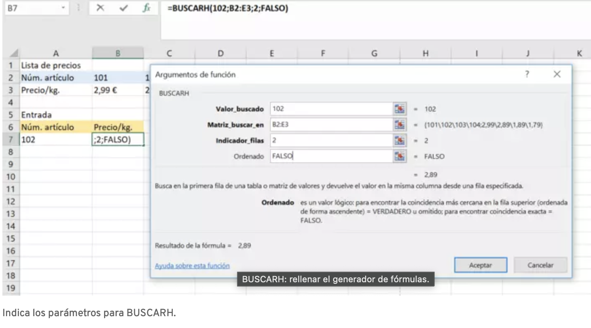
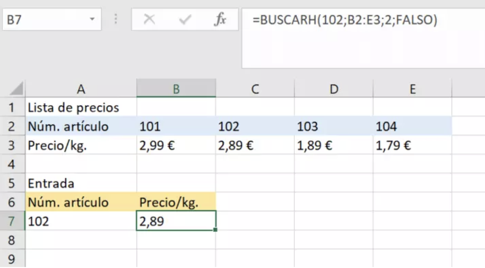

# Semana 4

## Cierre de Excel

#### Tabla de Contenido
- [Objetivo Semanal](#sección-1)
- [Metas Semanales](#sección-2)
- [Entrega 2 y 3 Semana](#sección-3)
- [Que hemos aprendido](#sección-4)
- [BuscarH y BuscarV](#sección-4)

	
### 📈[Objetivo Semanal](#sección-1)

El objetivo de la semana es cerrar con el uso satisfactorio de herramientas de hojas de cálculo: agregando en nuestra herammienta adicional en nuestro _toolbox_ : buscarh y buscarv.

### 📗[Metas Semanales](#sección-2)
 - [ ] Limpiar una BBDD de la que no sepamos nada
 - [ ] Construir Gráficos y Tablas Dínamicas
 - [ ] Utilizar buscarh y buscarv

 ### 📗[Entrega 2 y 3 Semana](#sección-3)
 - [ ] Crear una cuenta en [Github](github.com)
 - [ ] Crear un readme personal en Git utilizando Markdown
 - [ ] Crear una cuenta en Loom.com
 - [ ] Limpiar un hoja de cálculo en el software de elección
 - [ ] Documentar el algoritmo utilizando Markdown realizando un PR

 ### 📗[Uso del análisis computacional en Ciencias Sociales](#sección-4)
 -  [Alex](https://pudding.cool/2024/03/teenagers/)
 -  [Uso del espacio en España](https://especiales.eldiario.es/spain-lives-in-flats/)

 ### 📗[Que hemos aprendido](#sección-4)
> Concepto de una dominada de espalda(máquina en la caneca), adiestrar un perro, o montar moto: Progresiones y Repeticiones
1. Concepto de Hoja de Cálculo
2. Concepto de CSV: Limpiar una hoja de cálculo, Subjetividad en la limpieza
3. Tablas Dínamicas
4. Gráficas Dínamicas
5. Formato Condicional
6. Filtros
7. Formulación: BuscarH y BuscarV

 ### 📗[42 preguntas](#sección-5)
 ~~1. Promedio de Goles por década - Obligatoria ~~
 2. Top 10 de Torneos con más goleadores
 3. Máximo Goleador por Nacionalidad
 5. Conteo de goles por Nacionalidad 
 6. Promedio de Goles por tipo de torneo
~~ 7. Promedio de Goles por Ciudad~~
 8. Suma de Goles por Década
 9. Largo de Nombre de Jugador por Década 
 ~~10. Tendencia de Goles por Década~~
 11. Participación de Equipos Historica
 12. Top Goleador por Década
 13. Top Goleador por Equipo
 14. Participación de Equipos por Década
 ~~15. Participación historica del Cúcuta Deportivo~~
 ~~16. Colombia vs el Mundo~~
 18. Millonarios vs el Mundo
 19. Jugadores por Número de Goles
 20. Conteo de Goleadores únicos por equipo
 21. Mínimo número de goles por equipo
 22. Máximo de goles por equipo
 ~~23. Top 10 de goeadores historicos~~
 ~~24. Suma de Goles por equipo organizado de mayor a menor~~
 ~~25. Goles por Equipo~~
 25. Conteo de Torneos por década
 26. Conteo de Botines de oro por equipo
 27. Conteo de Botines de oro únicos por equipo
 28. Conteo de goles por Torneo (Top 10)
 29. Historia grafica del Bucaramanga
 30. Historia Gráfica de Ivan Rene Valenciano
 31. Historía Gráfica de Bógota
 ~~32. Historia Gráfica de Medellín~~
 ~~33. Historia de los Torneos Cortos en Goles~~
 ~~34. Top 10 goleadores de Millonarios~~
 35. Gráfico decente de goles por año
 36. Desviación Estandar e Intervalo de Confianza por Goles
 37. Goleadores únicos por país
 38. Goleadores únicos por tipo de Torneo
 39. Efectos de la profesionalización del mercado laboral 
 40. Largo de Nombres por equipo
 41. Largo de Nombres por País
 42. Libre

 ### 📗[BuscarH](#sección-5)

Comprender la sintaxis de BUSCARH

Para poder utilizar BUSCARH, debes comprender la sintaxis e introducirla correctamente. Como con cualquier fórmula de Excel, la más mínima desviación generará un mensaje de error o un resultado incorrecto. Sin embargo, una vez hayas comprendido los elementos que la componen, es muy fácil de aplicar y simplifica considerablemente el trabajo. Escrita a mano, la estructura de BUSCARH tiene el siguiente aspecto:

> =BUSCARH(valor_buscado;matriz;indicador_filas;verdadero/falso)

Cada parámetro tiene el siguiente significado:

    El signo de igual indica a Excel que vas a introducir una fórmula en la barra de edición y no un valor fijo.
    El valor buscado consiste en la palabra o valor que se va a buscar. Si es un término, se debe indicar entre comillas.
    La matriz contiene el rango de la tabla donde se encuentran los datos. Puedes seleccionarlo con el ratón o indicarlo manualmente.
    El indicador de filas indica en qué fila se encuentra el resultado. Por ejemplo, si el resultado está en la quinta fila, el indicador es “5”.
    Con verdadero o falso se indica si se muestra el resultado aun cuando la coincidencia no sea exacta. Si se elige VERDADERO, aparecen también coincidencias aproximadas, mientras que con FALSO solo aparecen las exactas.

 ### 📗[Entrega](#sección-6)

- Carpeta en Semana 4, con su nombre 
- 9 preguntas + 1 (la obligatoria) -> por lo menos 3 gráficos
    - Interpretación del gráfico o la dínamica
- Formulación BuscarH y BuscarV
- Entrega en 8 días