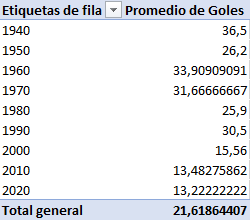
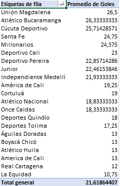
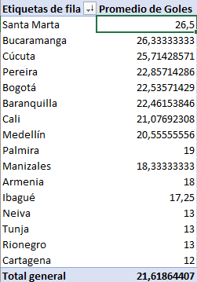
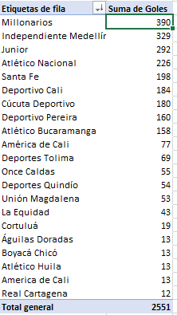
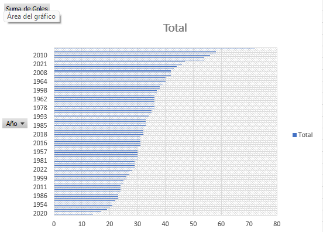
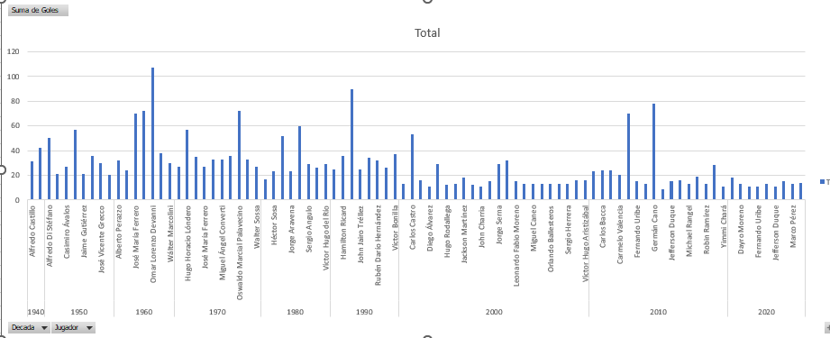
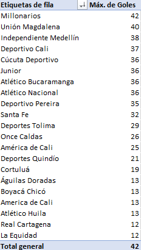
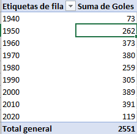
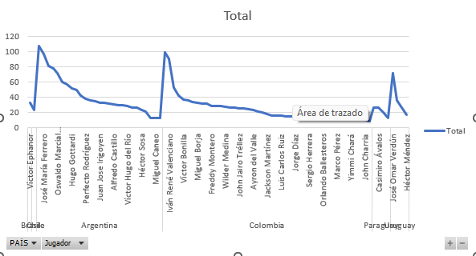
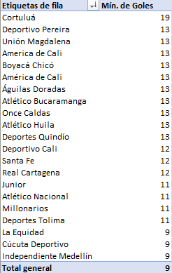

                            ##Futbol Colombiano⚽

🙌Hola a todos, mi nombre es Juan David Blanco y acontinuacion podran observar diferentes analisis que hice en cuanto al futbol Colombiano y sus datos.

1. Promedio de goles por década:Esta tabla de promedio de goles por década, he incluido las décadas desde 1940 hasta 2020. He calculado el promedio de goles para cada década y he organizado la información de manera clara. La tabla muestra cómo ha variado el promedio de goles a lo largo de las décadas, lo cual proporciona una visión general del rendimiento goleador en el fútbol colombiano a lo largo del tiempo.

2. Promedio de goles por equipo:En mi tabla de promedio de goles por equipo, he incluido la lista de equipos de fútbol colombiano junto con sus respectivos promedios de goles. En ella proporciono una comparación clara del rendimiento goleador de cada equipo a lo largo del tiempo, lo cual es crucial para entender el desempeño histórico de los equipos en el contexto del fútbol colombiano.

3. Promedio de goles por ciudad:Esta tabla de promedio de goles por ciudad, he incluido la lista de ciudades originarias de los equipos, junto con sus respectivos promedios de goles. Esta información permite comparar el rendimiento goleador de los equipos basados en cada ciudad a lo largo del tiempo, brindando así una perspectiva interesante sobre la contribución goleadora de cada región al fútbol colombiano.

4. Goles por equipo:En mi tabla de goles por equipo, se encuentra cada equipo de fútbol colombiano junto con la cantidad total de goles anotados a lo largo del tiempo. Esta información ofrece una visión completa del desempeño goleador de cada equipo, lo cual es fundamental para comprender la historia y el impacto de cada equipo en el contexto del fútbol colombiano. Además, permite identificar patrones y tendencias en el rendimiento goleador de cada equipo a lo largo de las décadas.

5. Grafico decendente de goles por año:Este gráfico descendente de goles por año, he representado visualmente la cantidad de goles anotados por año en el fútbol colombiano. Esta permite identificar claramente las tendencias en la cantidad de goles a lo largo del tiempo, mostrando de manera efectiva los picos y valles en el rendimiento goleador a lo largo de las décadas. También, proporciona una visión general del cambio en la producción goleadora a nivel histórico, lo cual es esencial para comprender la evolución del fútbol colombiano en términos de anotaciones.

6. Grafico top goleador por decada:Este gráfico de top goleador por década, he representado visualmente a los máximos goleadores de cada década en el fútbol colombiano. Esta representación gráfica permite identificar de manera clara a los jugadores destacados en términos de anotaciones en cada período, y da una visión histórica de los goleadores más influyentes en el fútbol colombiano a lo largo de las décadas. Esto resalta la evolución de las figuras destacadas en el ámbito goleador y su contribución al panorama futbolístico del país.

7. Máximo de goles por equipo:En mi gráfico del máximo de goles por equipo, he representado en una tabla la cantidad máxima de goles anotados por cada equipo de fútbol colombiano a lo largo del tiempo. Esta ofrece una comparación clara de los logros goleadores más destacados de cada equipo, mostrando de manera efectiva la evolución de los máximos registros goleadores a lo largo de las décadas. Asimismo, resalta la importancia del desempeño goleador sobresaliente de los  equipos en momentos específicos.

8. Suma de goles por decada:esta tabla de la suma de goles por década representa una métrica clave para comprender la evolución del rendimiento goleador en el fútbol colombiano a lo largo del tiempo.Aca proporciono una visión general del volumen de goles anotados en cada década, permitiendo identificar tendencia significativas y comparar el desempeño goleador entre distintos períodos.

9. Goleadores unicos por pais:elabore una tabla interesante que identifica y reconoce a aquellos futbolistas destacados que han dejado su huella en el ámbito goleador representando a su pais. Este enfoque permite resaltar la contribución individual de los jugadores , evidenciando su talento y capacidad.

10. Minimo de goles por equipo:Esta tabla que cree sobre análisis del mínimo de goles por equipo es fundamental para comprender la variabilidad en el rendimiento goleador de los equipos de fútbol colombiano a lo largo del tiempo. Con esto los registros mínimos de goles anotados por cada equipo permite destacar los momentos en los que el desempeño ofensivo fue más desafiante, lo cual puede estar relacionado con diversos factores como cambios en la plantilla, estrategias tácticas o condiciones del torneo.

**Muchas gracias a todos, espero estos análisis les ayuden a comprender de una manera más facil el futbol colombiano.**😎

