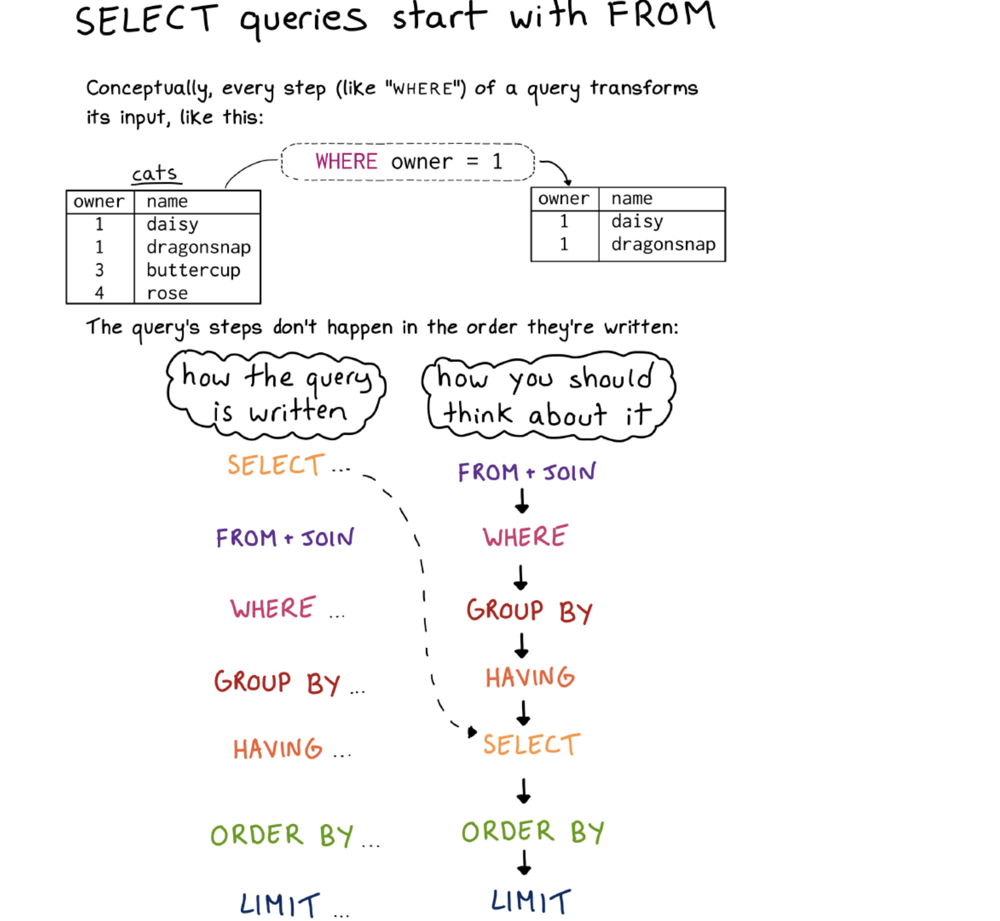

# Semana 5

## Python para todos 🐍🐍 y SQL para algunos 💿💿


#### Tabla de Contenido
- [Objetivo Semanal](#sección-1)
- [Metas Semanales](#sección-2)
- [Usos y abusos de la clase](#sección-3)
- [Base de Datos para el Semestre: Spotify Million Playlists - Editada](#sección-4)
- [SQL Estructura](#sección-5)
- [42 preguntas](#sección-6)


	
### 📈[Objetivo Semanal](#sección-1)

El objetivo de la semana es practicar nociones de SQL + seguir familiriandoze con la programación en Python y Jupyter.

> Concepto de una dominada de espalda(máquina en la caneca), adiestrar un perro, o montar moto: Progresiones y Repeticiones

### 📗[Metas Semanales](#sección-2)
 - [ ] Construir consultas en SQL que nos permitan acceder a una base de datos.
 - [ ] Construir métodos que nos permitan comprobar si las consultas son correctas.
 - [ ] Construir gráficos rudimentarios que nos permitan resumir los datos.

### 📈[Usos y abusos de la clase](#sección-3)
 -  [Repo de Datos -> Género en la UE🇪🇺](https://eige.europa.eu/gender-statistics/dgs)

 ### 🎶🎶 [Base de Datos para el Semestre: Spotify Million Playlists - Editada](#sección-4)
 - El [Spotify Million Playlist Challenge](https://research.atspotify.com/2020/09/the-million-playlist-dataset-remastered/) es una estructura de datos interesantisima que contiene metadatos de un millón de listas creadas en Spotify + las canciones que la componen(con sus respectivos metadatos). El objetivo del conjunto de datos es crear un _sandbox_ de algoritmos, abierto al público, en el problema de sistemas de recomendación. ¿Que es un modelo de recomendación? Es el modelo que permite predecir que después de escuchar Peso Pluma en el 99% de los casos el usuario no quiere escuchar Justice, Judas Priest o Disclosure. Para nuestro curso es maravilloso para practicar técnicas de exploración y de análitca básica en conjuntos de datos estructurados.


 ### 📗[¿Cómo funciona SQL?](#sección-5)


1. FROM + JOIN

Supongamos que queremos obtener todos los detalles de las canciones junto con la información de la lista de reproducción a la que pertenecen.


```
SELECT p.pid, p.name, s.track_name, s.artist_name
FROM Playlists p
JOIN Song s ON p.pid = s.pid
```

2. WHERE

Para filtrar y obtener sólo las listas de reproducción que tienen más de 50 seguidores.


```
SELECT pid, name, num_followers
FROM Playlists
WHERE num_followers > 50
```

3. GROUP BY + HAVING

Si deseas obtener el número de canciones en cada lista de reproducción, pero sólo para aquellas listas que tienen más de 10 canciones.

```
SELECT pid, COUNT(*) as num_songs
FROM Song
GROUP BY pid
HAVING COUNT(*) > 10
```

4. SELECT

Este es un ejemplo básico donde seleccionamos columnas específicas de una tabla.

```
SELECT pid, name, modified_at
FROM Playlists
```

5. ORDER BY

Para obtener todas las listas de reproducción ordenadas por la fecha de modificación más reciente.

```
SELECT pid, name, modified_at
FROM Playlists
ORDER BY modified_at DESC
```

6. LIMIT

Cuando solo quieres obtener un número limitado de registros, por ejemplo, las 10 primeras canciones más recientes.

```
SELECT track_name, artist_name, modified_at
FROM Song
ORDER BY modified_at DESC
LIMIT 10
```


 ### 📗[42 preguntas](#sección-6)

- Bloque 1
1. Top 20 de Playlists mas Recientes -> Utilizar modified at mayor que
2. Contar el número total de playlists -> Utilizar COUNT() 
3. Seleccionar la playlist con un pid específico:incluyendo las canciones -> Utilizar un JOIN
4. Seleccionar las playlists que tienen más de cierta cantidad de seguidores
5. Contar el número total de canciones
6. Contar el número total de canciones únicas
7. Seleccionar todas las canciones de un artista específico y en cuantas listas aparece -> Utilizar un JOIN
8. Seleccionar todas las canciones de un álbum específico y en cuantas listas aparece -> Utilizar un JOIN
9. Nombres de las 10 canciones mas largas en duración
10. Contar el número total de canciones en una playlist específica
11. Contar cuantas listas existen por número de canciones -> Utilizar CASE
12. Seleccionar todas las playlists que contienen una canción específica
13. Contar el número de playlists que contienen canciones de un cierto artista
14. Seleccionar las playlists que tienen más canciones que álbumes
15. Seleccionar las playlists que tienen mas seguidores de que canciones

- Bloque 2
1. Calcular la duración total de todas las canciones en una playlist específica
2. Obtener la duración promedio de las canciones de las 10 playlists con más canciones
3. Encontrar la cantidad máxima de tracks en todas las playlists
4. Contar la cantidad total de playlists que contienen más de 10 canciones -> Utilizar WHERE
5. Encontrar la duración más larga y más corta de todas las canciones
6. Calcular la suma total de duraciones de todas las canciones de un artista específico
7. Contar la cantidad de playlists que contienen canciones de más de un álbum -> Utilizar HAVING
8. Calcular la cantidad total de canciones en cada playlist y ordenarlas de mayor a menor
9. Número de canciones por lista -> Utilizar CASE
10. Promedio de duración de canciones por número de seguidores -> utilizar doble CASE
11. Seleccionar las canciones que duran más de la duración promedio de todas las canciones


- Bloque 3 -> Utilizar JOIN
1. Calcular la duración total y promedio de todas las canciones en una playlist específica
2. Calcular la duración total de todas las canciones de un artista específico en todas las playlists
3. Contar la cantidad de playlists que contienen más de un álbum diferente
4. Calcular la cantidad total de canciones en cada playlist y ordenarlas de mayor a menor
5. Obtener el promedio de canciones por playlist
6. Contar la cantidad total de playlists que contienen más de 10 canciones -> Utilizar un COUNT(*)
7. Contar la cantidad de artistas que tienen mas de una canción vs los que tienen sólo una canción
8. Contar la cantidad de playlists que contienen más de una canción de un álbum específico
9. Calcular la duración total de todas las canciones en playlists con más de 50 tracks


