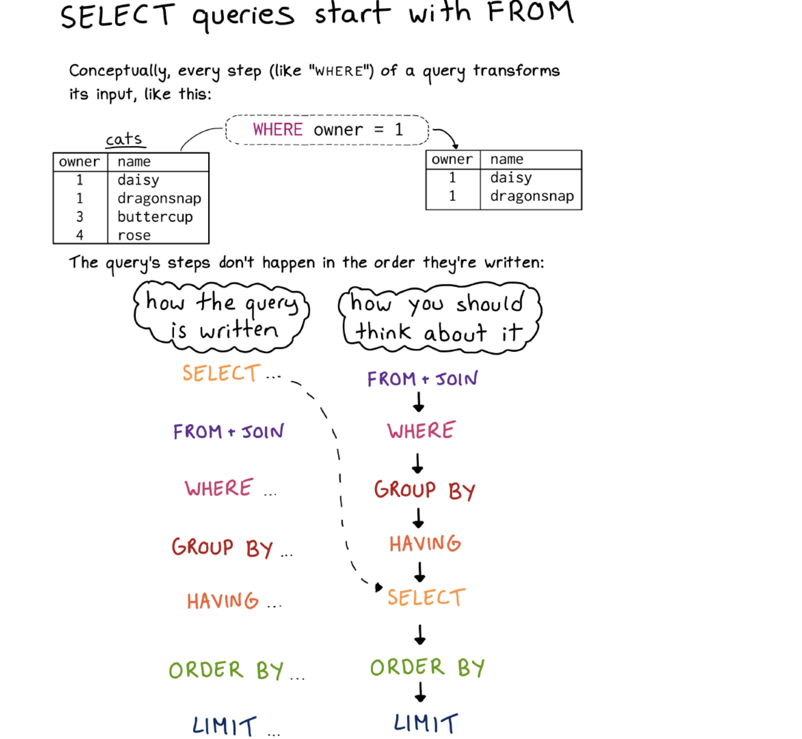

# Semana 6

## SQL profundo 😅


#### Tabla de Contenido
- [Objetivo Semanal](#sección-1)
- [Metas Semanales](#sección-2)
- [Base de Datos para el Semestre: Spotify Million Playlists - Editada](#sección-3)
- [SQL Estructura](#sección-4)
- [42 preguntas](#sección-5)


	
### 📈[Objetivo Semanal](#sección-1)

El objetivo de la semana es practicar nociones de SQL + seguir familiriandoze con la programación en Python y Jupyter.

> Concepto de una dominada de espalda(máquina en la caneca), adiestrar un perro, o montar moto: Progresiones y Repeticiones

### 📗[Metas Semanales](#sección-2)
 - [ ] Construir consultas en SQL que nos permitan acceder a una base de datos.
 - [ ] Construir métodos que nos permitan comprobar si las consultas son correctas.
 - [ ] Construir gráficos rudimentarios que nos permitan resumir los datos.

### 📈[Usos y abusos de la clase](#sección-3)

 -  [Complejidad Presidencial](https://bastian.rieck.me/blog/2017/inauguration_speeches_brief/)

 ### 🎶🎶 [Base de Datos para el Semestre: Spotify Million Playlists - Editada](#sección-4)


Buenas Noticias:
 -  [Google Colab](https://colab.research.google.com/?hl=es)

 1. Suben la base de datos
 2. Copian y pegan los comandos para instalar y crear la conexión
 3. Descargan el cuaderno como py para crear el PR  + incluir el PR el link como ipnyb

```
from google.colab import drive
drive.mount('/content/drive')
```

```
%sql  sqlite:////content/drive/My Drive/path_to_your_database.db
```


 - Consumir este link en Onedrive [Spotify Million Playlist Challenge](https://uniandes-my.sharepoint.com/:u:/g/personal/ce_cortes410_uniandes_edu_co/EUtFzWyn3AhJt1rcs18CjUYBErNiPFnzlPNhnLfPRHXiFg?e=4qhvaI)


 ### 📗[¿Cómo funciona SQL?](#sección-4)



#### GROUP BY

Por supuesto, la cláusula GROUP BY en SQL se utiliza para agrupar filas que comparten un valor común en una o más columnas y realizar operaciones de agregación en esos grupos. Esto nos permite calcular estadísticas resumidas sobre cada grupo de datos.

En resumen, GROUP BY funciona de la siguiente manera:

    Se especifica una o más columnas por las cuales queremos agrupar los datos.
    Las filas que tienen los mismos valores en esas columnas se agrupan juntas.
    Se pueden aplicar funciones de agregación, como COUNT(), SUM(), AVG(), MAX(), MIN(), etc., para calcular estadísticas sobre los grupos de datos.

Supongamos que tenemos una tabla llamada "ventas" que contiene información sobre las ventas de productos en una tienda. Queremos calcular el total de ventas para cada mes. Aquí está cómo lo haríamos:

```
SELECT MONTH(fecha_venta) AS mes,
       SUM(monto) AS total_ventas
FROM ventas
GROUP BY MONTH(fecha_venta);
```

En este ejemplo, estamos agrupando las ventas por mes usando la función MONTH() para extraer el mes de la columna "fecha_venta". Luego, calculamos la suma de los montos de ventas para cada mes usando la función de agregación SUM().

Utilizando la tabla de playlists, podríamos querer calcular el número total de canciones en cada playlist. Aquí está cómo lo haríamos:

```
SELECT pid,
       COUNT(*) AS total_canciones
FROM Songs
GROUP BY pid;
```


#### CASE

La cláusula CASE en SQL proporciona una forma de realizar evaluaciones condicionales en una consulta y devuelve un valor basado en el resultado de estas evaluaciones. Es útil cuando necesitas realizar cálculos condicionales o transformar datos según ciertas condiciones.

La sintaxis básica de la cláusula CASE es la siguiente:

```
CASE
    WHEN condicion1 THEN resultado1
    WHEN condicion2 THEN resultado2
    ...
    ELSE resultado_predeterminado
END
```

Ahora aplicado a playlists. En este ejemplo, la cláusula CASE evalúa el número de seguidores (num_followers) de cada playlist. Dependiendo del valor de num_followers, asigna la categoría correspondiente ('Baja', 'Media' o 'Alta') a la columna llamada 'popularidad'. Esto nos permite clasificar las playlists en diferentes niveles de popularidad según el número de seguidores que tienen.
```
SELECT
    pid,
    num_followers,
    CASE
        WHEN num_followers < 100 THEN 'Baja'
        WHEN num_followers >= 100 AND num_followers <= 1000 THEN 'Media'
        ELSE 'Alta'
    END AS popularidad
FROM Playlists;
```

O para operaciones númerica complejas

```
SELECT
    COUNT(*) AS total_playlists,
    SUM(CASE WHEN Songs.artist_name = 'nombre_artista' THEN 1 ELSE 0 END) AS canciones_artista_especifico,
    SUM(CASE WHEN Songs.artist_name != 'nombre_artista' THEN 1 ELSE 0 END) AS otras_canciones
FROM Playlists
JOIN Songs ON Playlists.pid = Songs.pid;
```


#### Combinando

Podemos usar la cláusula CASE junto con la función GROUP BY para calcular estadísticas agregadas basadas en diferentes categorías. Por ejemplo, podríamos querer contar la cantidad de playlists en cada categoría de popularidad. Aquí está el ejemplo:

```
SELECT
    CASE
        WHEN num_followers < 100 THEN 'Baja'
        WHEN num_followers >= 100 AND num_followers <= 1000 THEN 'Media'
        ELSE 'Alta'
    END AS popularidad,
    COUNT(*) AS cantidad_playlists
FROM Playlists
GROUP BY popularidad;
```
En este ejemplo, la cláusula CASE se utiliza dentro de la función COUNT() junto con GROUP BY. Esto agrupa las playlists en diferentes categorías de popularidad según el número de seguidores que tienen. Luego, COUNT() cuenta la cantidad de playlists en cada categoría de popularidad.


#### Utilizar WITH

Usar la cláusula WITH, también conocida como "Common Table Expression" (CTE), nos permite definir una o más consultas dentro de la misma consulta principal. Esto puede hacer que las consultas sean más legibles y modulares.

Por ejemplo, podríamos usar WITH para primero calcular la popularidad de cada playlist y luego realizar operaciones agregadas basadas en esas categorías de popularidad.
```
WITH PopularidadPlaylist AS (
    SELECT
        pid,
        num_followers,
        CASE
            WHEN num_followers < 100 THEN 'Baja'
            WHEN num_followers >= 100 AND num_followers <= 1000 THEN 'Media'
            ELSE 'Alta'
        END AS popularidad
    FROM Playlists
)

SELECT
    popularidad,
    COUNT(*) AS cantidad_playlists
FROM PopularidadPlaylist
GROUP BY popularidad;
```

En este ejemplo, la cláusula WITH define una CTE llamada "PopularidadPlaylist", que calcula la popularidad de cada playlist basada en el número de seguidores. Luego, utilizamos esa CTE en la consulta principal para contar la cantidad de playlists en cada categoría de popularidad. Esto hace que la consulta sea más modular y fácil de entender.

### Utilizar JOIN

La cláusula JOIN en SQL se utiliza para combinar filas de dos o más tablas basadas en una condición de relación entre ellas. Esto nos permite relacionar datos de diferentes tablas y obtener información más completa y detallada.

Veamos cómo usar JOIN con y sin la tabla de playlists:

Ejemplo sin playlists:

Supongamos que tenemos dos tablas: una tabla de "clientes" que contiene información sobre los clientes de una tienda, y una tabla de "compras" que contiene información sobre las compras realizadas por esos clientes. Queremos combinar la información de estas dos tablas para obtener detalles sobre las compras de los clientes, como su nombre y la fecha de la compra.

```
SELECT clientes.nombre, compras.fecha, compras.monto
FROM clientes
JOIN compras ON clientes.id = compras.id_cliente;
```

En este ejemplo, estamos combinando las tablas de "clientes" y "compras" utilizando la cláusula JOIN. La condición de unión es que el "id" en la tabla de "clientes" sea igual al "id_cliente" en la tabla de "compras". Esto nos permite obtener detalles sobre las compras de los clientes, como su nombre y la fecha de la compra.

Ejemplo con playlists:

Utilizando la tabla de playlists que proporcionaste anteriormente, podríamos querer combinar la información de las playlists con la información de las canciones en esas playlists. Por ejemplo, podríamos querer obtener el nombre de la playlist junto con el nombre de todas las canciones en esa playlist.

```
SELECT Playlists.pid, Playlists.nombre AS nombre_playlist, Songs.track_name
FROM Playlists
JOIN Songs ON Playlists.pid = Songs.pid;

```

En este ejemplo, estamos combinando las tablas de "Playlists" y "Songs" utilizando la cláusula JOIN. La condición de unión es que el "pid" en la tabla de "Playlists" sea igual al "pid" en la tabla de "Songs". Esto nos permite obtener el nombre de la playlist junto con el nombre de todas las canciones en esa playlist.

 ### 📗[42 preguntas](#sección-5)
 3 - 4 - 3

- Bloque 1
1. Top 20 de Playlists mas Recientes -> Utilizar modified at mayor que
2. Contar el número total de playlists -> Utilizar COUNT() 
3. Seleccionar la playlist con un pid específico:incluyendo las canciones -> Utilizar un JOIN
4. Seleccionar las playlists que tienen más de cierta cantidad de seguidores
5. Contar el número total de canciones
6. Contar el número total de canciones únicas
7. Seleccionar todas las canciones de un artista específico y en cuantas listas aparece -> Utilizar un JOIN

```
%%sql  

WITH canciones_dylan AS (
SELECT DISTINCT pid
FROM song
WHERE artist_name = 'Bob Dylan' )

SELECT COUNT(*)
FROM playlists a
INNER JOIN canciones_dylan b
ON a.pid = b.pid
```

8. Seleccionar todas las canciones de un álbum específico y en cuantas listas aparece -> Utilizar un JOIN
9. Nombres de las 10 canciones mas largas en duración
10. Contar el número total de canciones en una playlist específica
11. Contar cuantas listas existen por número de canciones -> Utilizar CASE
12. Seleccionar todas las playlists que contienen una canción específica
13. Contar el número de playlists que contienen canciones de un cierto artista
14. Seleccionar las playlists que tienen más canciones que álbumes
15. Seleccionar las playlists que tienen mas seguidores de que canciones

- Bloque 2

1. Calcular la duración total de todas las canciones en una playlist específica
2. Obtener la duración promedio de las canciones de las 10 playlists con más canciones
3. Encontrar la cantidad máxima de tracks en todas las playlists
4. Contar la cantidad total de playlists que contienen más de 10 canciones -> Utilizar WHERE
5. Encontrar la duración más larga y más corta de todas las canciones
6. Calcular la suma total de duraciones de todas las canciones de un artista específico
7. Contar la cantidad de playlists que contienen canciones de más de un álbum -> Utilizar HAVING
8. Calcular la cantidad total de canciones en cada playlist y ordenarlas de mayor a menor
9. Número de canciones por lista -> Utilizar CASE
10. Promedio de duración de canciones por número de seguidores 

%%sql 

```
WITH CeliaCruz AS (
    SELECT
        pid,
        num_followers,
        CASE
            WHEN num_followers < 100 THEN 'Baja'
            WHEN num_followers >= 100 AND num_followers <= 500 THEN 'Media-Baja'
            WHEN num_followers >= 500 AND num_followers <= 1500 THEN 'Media-Alta'
            ELSE 'Alta'
        END AS popularidad
    FROM playlists
)

SELECT
    popularidad,
    AVG(num_followers) AS promedio_f
FROM CeliaCruz
GROUP BY popularidad;
11. Seleccionar las canciones que duran más de la duración promedio de todas las canciones
```

- Bloque 3 -> Utilizar JOIN
1. Calcular la duración total y promedio de todas las canciones en una playlist específica
2. Calcular la duración total de todas las canciones de un artista específico en todas las playlists
3. Contar la cantidad de playlists que contienen más de un álbum diferente
4. Calcular la cantidad total de canciones en cada playlist y ordenarlas de mayor a menor
5. Obtener el promedio de canciones por playlist
6. Contar la cantidad total de playlists que contienen más de 10 canciones -> Utilizar un COUNT(*)
7. Contar la cantidad de artistas que tienen mas de una canción vs los que tienen sólo una canción
8. Contar la cantidad de playlists que contienen más de una canción de un álbum específico
9. Calcular la duración total de todas las canciones en playlists con más de 50 tracks


