# Semana 6

## Gráficos y ciencia de datos básica


#### Tabla de Contenido
- [Objetivo Semanal](#sección-1)
- [Metas Semanales](#sección-2)
- [Base de Datos para el Semestre: Spotify Million Playlists - Editada](#sección-3)
- [Sobre la Entrega](#sección-4)
- [Gráficos](#sección-5)
- [Nuestros Gráficos](#sección-6)


	
### 📈[Objetivo Semanal](#sección-1)

El objetivo de la sesión es con la misma base de datos construir las nociones básicas de ciencia de datos y programación cientifica

### 📗[Metas Semanales](#sección-2)
 - [ ] Construir consultas en SQL que nos permitan acceder a una base de datos.
 - [ ] Construir métodos que nos permitan comprobar si las consultas son correctas.
 - [ ] Construir gráficos rudimentarios que nos permitan resumir los datos.

### 📈[Usos y abusos de la clase](#sección-3)

 -  [Crisis de la Replicabilidad](https://www.nature.com/articles/s44271-023-00003-2)
 -  [Power Poses](https://www.ted.com/talks/amy_cuddy_your_body_language_may_shape_who_you_are?language=es)
 -  [Crisis de la Austeridad](https://www.newyorker.com/news/john-cassidy/the-reinhart-and-rogoff-controversy-a-summing-up)

### 🎶🎶 [Sobre la Entrega](#sección-4)

##### Entrega 3 
- Plazo medianoche del viernes 17
- Horario de atención: Tarde del martes y hoy usando el link de Calendly
- Agregué mas ejemplos en la guia de la Semana 6

##### Entrega 4

- Datos de Spotify - Jueves 30 Medianoche
- 1 Cuaderno de Jupyter:  5 Preguntas, 5 rectangulos(consultas de SQL), 5 Gráficos diferentes con ejes, título y colores, 1 Párrafo respondiendo la pregunta de investigación
 - Tipos de Gráfico: Histograma, Gráficos de Relación, Categoricos, Matriz, Regresión
- Base de Datos: Spotify

Tengo que usar Seaborn? Puedo Usar cualquier biblioteca de gráficos: matplotlib, seaborn, ggplot2, plotly...


 ### 📊[Gráficos](#sección-5)

Crear gráficos es fundamental en muchas áreas del conocimiento y la industria porque ofrecen una manera visual e intuitiva de interpretar y comunicar datos complejos. Algunas razones clave por las cuales la creación de gráficos es tan importante:

1. Visualización de Tendencias y Patrones

Los gráficos permiten visualizar tendencias y patrones en los datos que podrían no ser evidentes cuando se miran números en bruto. Por ejemplo, tendencias temporales, ciclos estacionales, o correlaciones entre variables se pueden identificar más fácilmente en un gráfico que en una tabla de datos.

2. Facilitación de la Comprensión Rápida

Los gráficos pueden comunicar información compleja de manera rápida y eficaz. En entornos empresariales, académicos o de cualquier otra índole, tener la capacidad de comprender rápidamente los resultados clave de un análisis puede ser crucial para tomar decisiones informadas.

3. Comparación de Datos

Los gráficos son útiles para comparar conjuntos de datos de manera clara y directa. Por ejemplo, comparar el rendimiento de diferentes productos, los resultados de diferentes grupos experimentales, o los indicadores económicos a lo largo del tiempo puede ser más comprensible si se presenta visualmente.

4. Identificación de Anomalías

Un gráfico puede ayudar a identificar outliers o datos anómalos que podrían indicar errores de medición, entradas erróneas, o fenómenos interesantes que merecen un estudio más detallado. La detección de estas anomalías es a menudo más difícil al revisar tablas de datos.

5. Comunicación Efectiva

Los gráficos son una herramienta esencial para comunicar análisis y hallazgos a un público más amplio, incluidos aquellos que pueden no tener una formación técnica detallada. Un buen gráfico puede hacer que la información sea accesible para una variedad de audiencias, facilitando la presentación y discusión de resultados.

6. Apoyo en la Toma de Decisiones

En la gestión empresarial, la política pública, la ingeniería, y muchas otras áreas, los gráficos son fundamentales para apoyar la toma de decisiones. Permiten a los tomadores de decisiones ver los resultados y escenarios proyectados, evaluar opciones y prever los efectos de sus elecciones.

7. Estímulo al Análisis Más Profundo

Un gráfico bien diseñado no solo informa sino que también puede inspirar preguntas adicionales y exploración de datos. Puede indicar áreas donde se necesita más investigación o sugerir nuevas formas de analizar la información.

8. Documentación y Registro

Los gráficos también sirven como documentación en la investigación y el análisis de datos, proporcionando un registro visual que puede ser revisado por otros o por uno mismo en el futuro.

#### 5 tipos Gráficos Estadísticos

- Gráficos de distribución como histogramas, gráficos de densidad, y gráficos de estimación de densidad kernel.
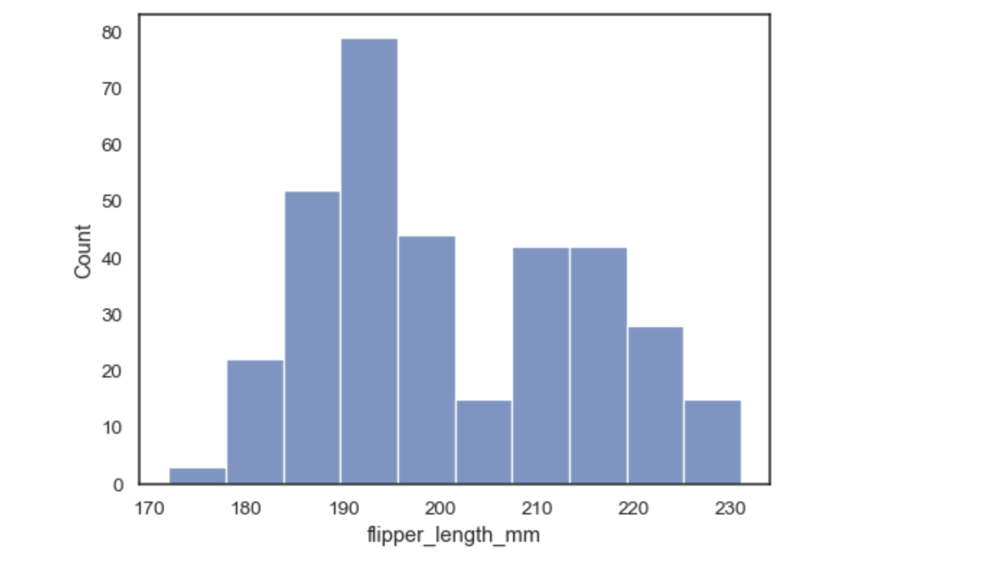
- Gráficos de relación que incluyen scatter plots, line plots y pair plots para explorar correlaciones entre múltiples variables.
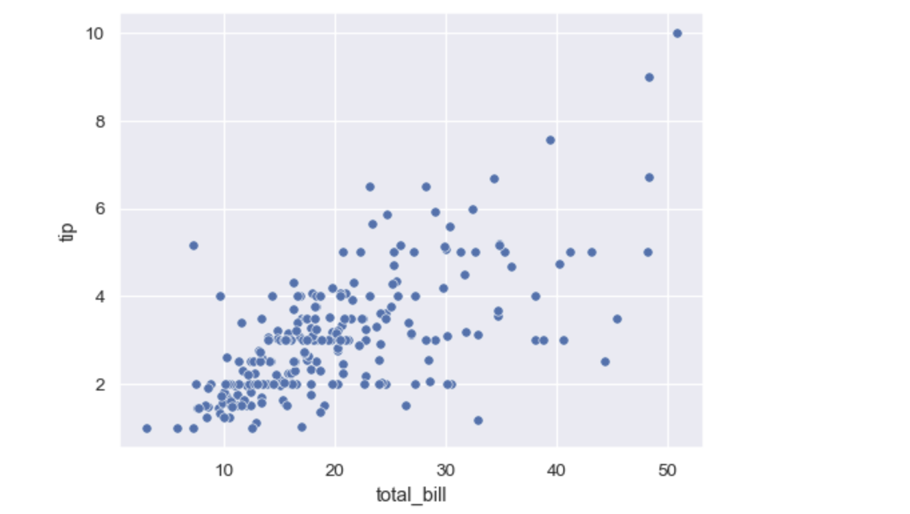
- Gráficos categóricos como box plots, violin plots, bar plots y point plots, que ayudan a visualizar distribuciones y comparaciones de categorías.
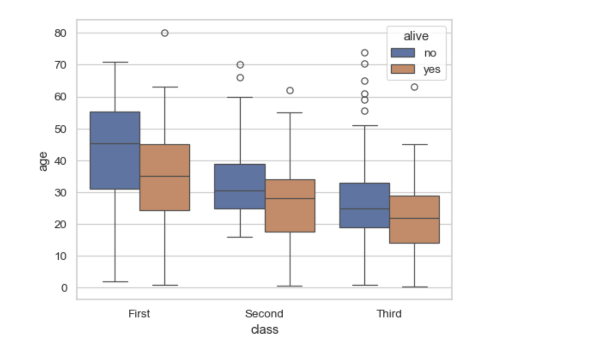
- Gráficos de matriz como heatmaps y clustermaps, que son útiles para explorar correlaciones y agrupaciones.
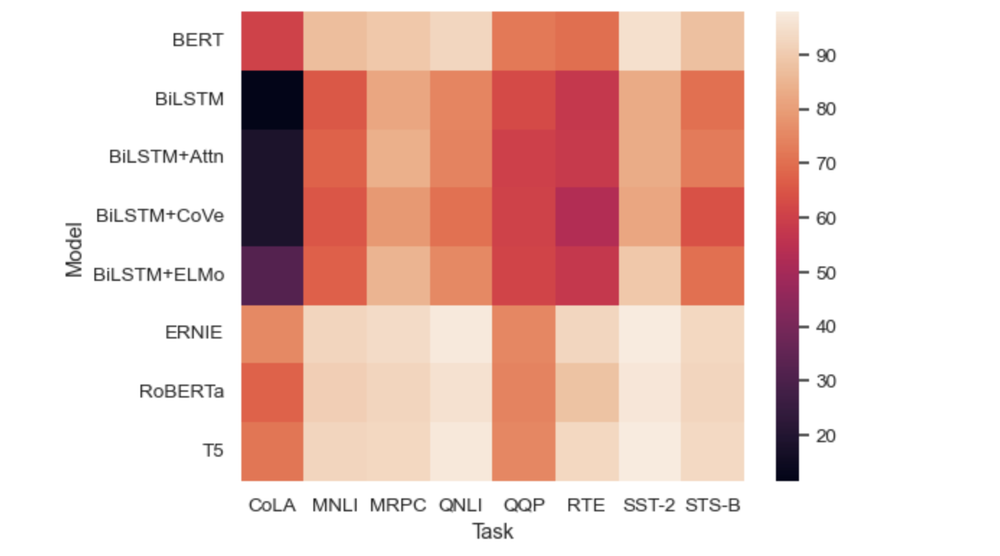
- Gráficos de regresión que facilitan la visualización de modelos lineales en los datos.
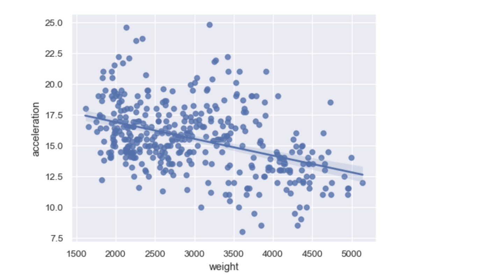


 ### 🐧[Nuestros Gráficos](#sección-6)

 ### Hablemos de Histogramas

Un histograma es un tipo de gráfico estadístico que se utiliza para representar la distribución de datos numéricos mediante la agrupación de estos en "bins" o intervalos. Cada bin representa un rango específico de datos, y el número de datos que caen en cada bin se muestra mediante barras, lo que permite visualizar la frecuencia de los datos distribuidos a lo largo de diferentes rangos.

##### Componentes Clave de un Histograma

    Barras: Cada barra del histograma representa un intervalo de valores, conocido como bin. La altura de la barra muestra la cantidad de datos que caen en ese rango.

    Ejes:
        Eje Horizontal (X): Representa los intervalos de valores de los datos. Estos intervalos son generalmente numéricos y equidistantes.
        Eje Vertical (Y): Representa la frecuencia de los datos en cada intervalo. Esto puede ser el conteo absoluto o el porcentaje del total, dependiendo de cómo se configure el histograma.

##### Propósitos del Histograma

    Visualizar la distribución de los datos: Ayuda a entender cómo están distribuidos los datos a lo largo de diferentes valores.
    Identificar la centralidad y la dispersión: Permite ver rápidamente dónde se concentran los valores y cuán dispersos están.
    Detectar la forma de la distribución: Puede revelar si la distribución de los datos es simétrica, sesgada a la izquierda o derecha, tiene múltiples modas, etc.
    Identificar outliers: Los valores extremos pueden aparecer como barras aisladas en los extremos del histograma.
    Comparar distribuciones: Comparar histogramas de diferentes conjuntos de datos puede proporcionar insights sobre cómo varían en términos de centralidad, dispersión, y forma.

##### Creación de un Histograma

Para crear un histograma, el rango de los datos se divide en segmentos o bins, y se cuenta cuántos valores caen en cada bin. El número de bins puede afectar significativamente la apariencia del histograma y, por lo tanto, la interpretación de los datos. Demasiados bins pueden resultar en un gráfico con mucha variabilidad y difícil de interpretar, mientras que muy pocos bins pueden ocultar detalles importantes de la distribución.

```
# unverified ssl 
import ssl
ssl._create_default_https_context = ssl._create_unverified_context
## importar la librería -> solo hay que hacerlo una vez
import seaborn as sns
## cargar el set de datos -> solo hay que hacerlo una vez por "rectangulo"
penguins = sns.load_dataset("penguins")
### ejecutar el gráfico
sns.histplot(data=penguins, x="flipper_length_mm")
```

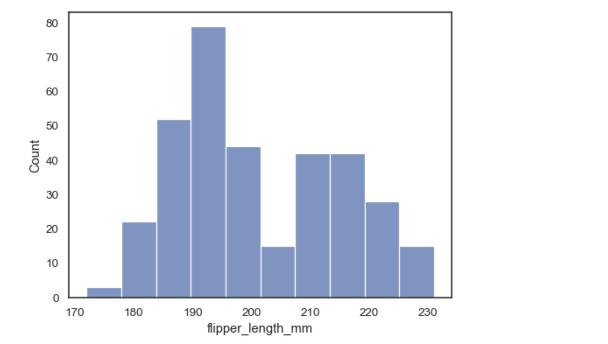

- Podemos complejizarlo

```
## que tan grandes son las columnas
sns.histplot(data=penguins, x="flipper_length_mm", binwidth=3)
```
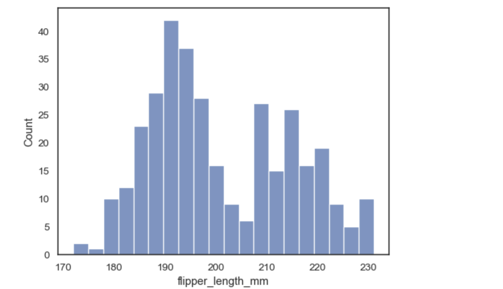


```
### Cambiando  el número de cajas
sns.histplot(data=penguins, x="flipper_length_mm", binwidth=3, bins = 30)
```

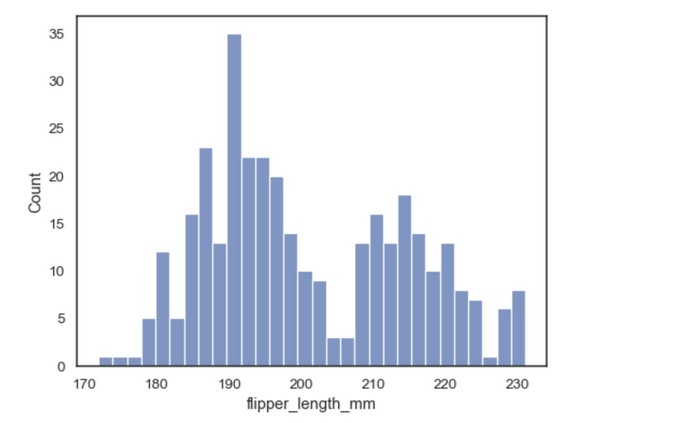

```
Agregando una función de suavizado
sns.histplot(data=penguins, x="flipper_length_mm", kde=True)
```

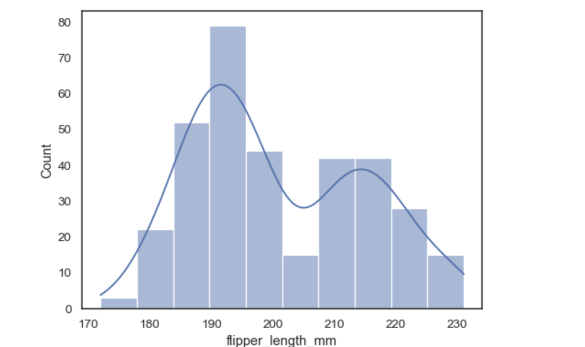

```
Agregando una segunda variable
sns.histplot(data=penguins, x="flipper_length_mm", hue="species")
```
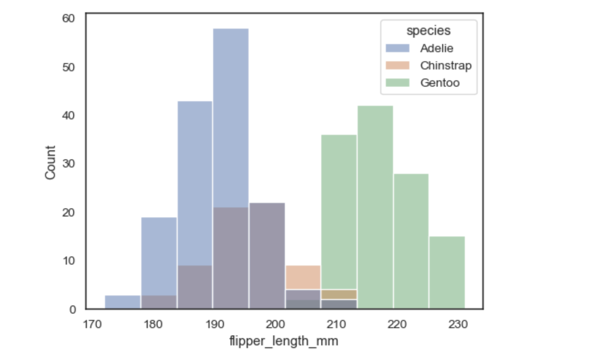


```
Agregando una segunda variable
sns.histplot(data=penguins, x="flipper_length_mm", hue="species",  element="poly")
```

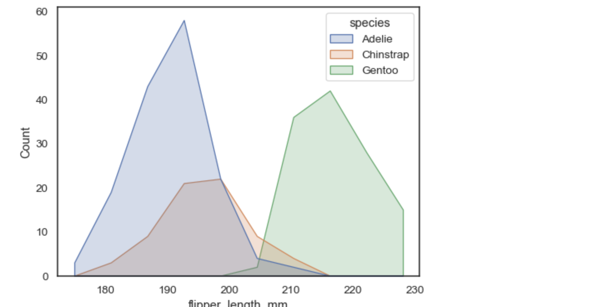


#### Vamos a usar seaborn

Seaborn es una biblioteca de visualización de datos en Python que se basa en Matplotlib. Está diseñada para crear visualizaciones estadísticas informativas y atractivas de manera sencilla. Seaborn facilita la elaboración de gráficos complejos que serían difíciles o tediosos de crear utilizando únicamente Matplotlib. Aquí hay algunos aspectos clave de Seaborn que lo hacen especialmente útil para la visualización de datos estadísticos.

 -  [Seaborn](https://seaborn.pydata.org/index.html)