# Semana 7

## Gráficos y ciencia de datos básica


#### Tabla de Contenido
- [Objetivo Semanal](#sección-1)
- [Metas Semanales](#sección-2)
- [Sobre la Entrega 4](#sección-3)
- [Gráficos](#sección-4)
- [Sobre la Entrega 3](#sección-5)


	
### 📈[Objetivo Semanal](#sección-1)

- Tener recetas para 5 tipos de gráficos diferentes
- Tener recetas para editarlos y poderlos usar en diferentes contextos

### 📗[Metas Semanales](#sección-2)

 - [ ] Cosntruir gráficos que puedan ser usados en contextos formales


### 📈[Sobre la Entrega 4](#sección-3)

- Horario de Atención hasta las 12.30
- Abriré un link en Calendly en la tarde del miércoles, pido respeto por la asistencia
- 5 tipos de gráficos, con todas las de la ley y reporte de cada gráfico.

- Datos de Spotify - Jueves 30 Medianoche
- 1 Cuaderno de Jupyter:  5 Preguntas, 5 rectangulos(consultas de SQL), 5 Gráficos diferentes con ejes, título y colores, 1 Párrafo respondiendo la pregunta de investigación
 - Tipos de Gráfico: Histograma, Gráficos de Relación, Categoricos, Matriz, Regresión
- Base de Datos: Spotify

Tengo que usar Seaborn? Puedo Usar cualquier biblioteca de gráficos: matplotlib, seaborn, ggplot2, plotly...

#### ¿Cómo usar la base de spotify para construir gráficos?


##### Colab

- Usando la base de datos de la entrega en collab:

- Subir la base de datos a Collab

```
import sqlite3
import pandas as pd

# Conectarse a la base de datos
connection = sqlite3.connect('music_smaller.db')

# Crear el query entre comillas y transformaarlos en una dataframe
query = "SELECT * FROM playlists"
datos = pd.read_sql_query(query, connection)

# Mostrar cómo queda el archivo
print(df.head())

# Cerrar la conexión
connection.close()

```


##### VScode

- Abrir un cuaderno de Jupyter

- Ejecutar el siguiente fragmento de código
```
import sqlite3
import pandas as pd

# Conectarse a la base de datos
connection = sqlite3.connect('music_smaller.db')

# Crear el query entre comillas y transformaarlos en una dataframe
query = "SELECT * FROM playlists"
datos = pd.read_sql_query(query, connection)

# Mostrar cómo queda el archivo
print(df.head())

# Cerrar la conexión
connection.close()

```

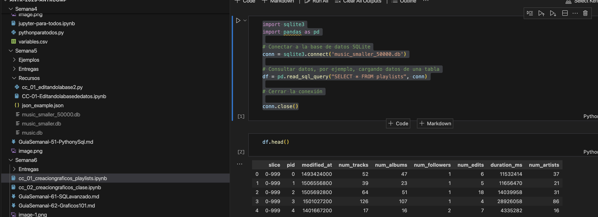


#### Cómo subir un csv a collab para tirar gráficos y usar las recetas

```
import pandas as pd

# Asegúrate de poner el nombre correcto de tu archivo
file_path = '/content/tu_archivo.csv'  # Ajusta el nombre del archivo según corresponda

# Especificar la codificación y el separador
# Cambia 'utf-8' y ';' según sea necesario para tu archivo
dataframe = pd.read_csv(file_path, encoding='utf-8', sep=';')

# Mostrar las primeras filas del DataFrame para verificar que se cargó correctamente
print(dataframe.head())

```

- Explicaciones Adicionales

    encoding='utf-8': Este es el argumento donde especificas la codificación del archivo. Si no estás seguro de la codificación, utf-8 es una apuesta segura para muchos casos, pero si encuentras caracteres extraños en tu output, puedes intentar con latin1 o iso-8859-1.
    sep=';': Aquí defines el separador de campos en tu archivo. Si tu archivo usa puntos y coma en lugar de comas para separar los campos, debes especificarlo así.

Usar estos parámetros te ayudará a manejar la mayoría de los problemas comunes al cargar archivos CSV en pandas. Si continúas teniendo problemas, verifica que el archivo no tenga errores de formato y que los parámetros especificados sean realmente los correctos para tu archivo.

### 📊 [Gráficos](#sección-4)


#### 5 tipos Gráficos Estadísticos

- Gráficos de distribución como histogramas, gráficos de densidad, y gráficos de estimación de densidad kernel.
 ✅✅
- Gráficos de relación que incluyen scatter plots, line plots y pair plots para explorar correlaciones entre múltiples variables.
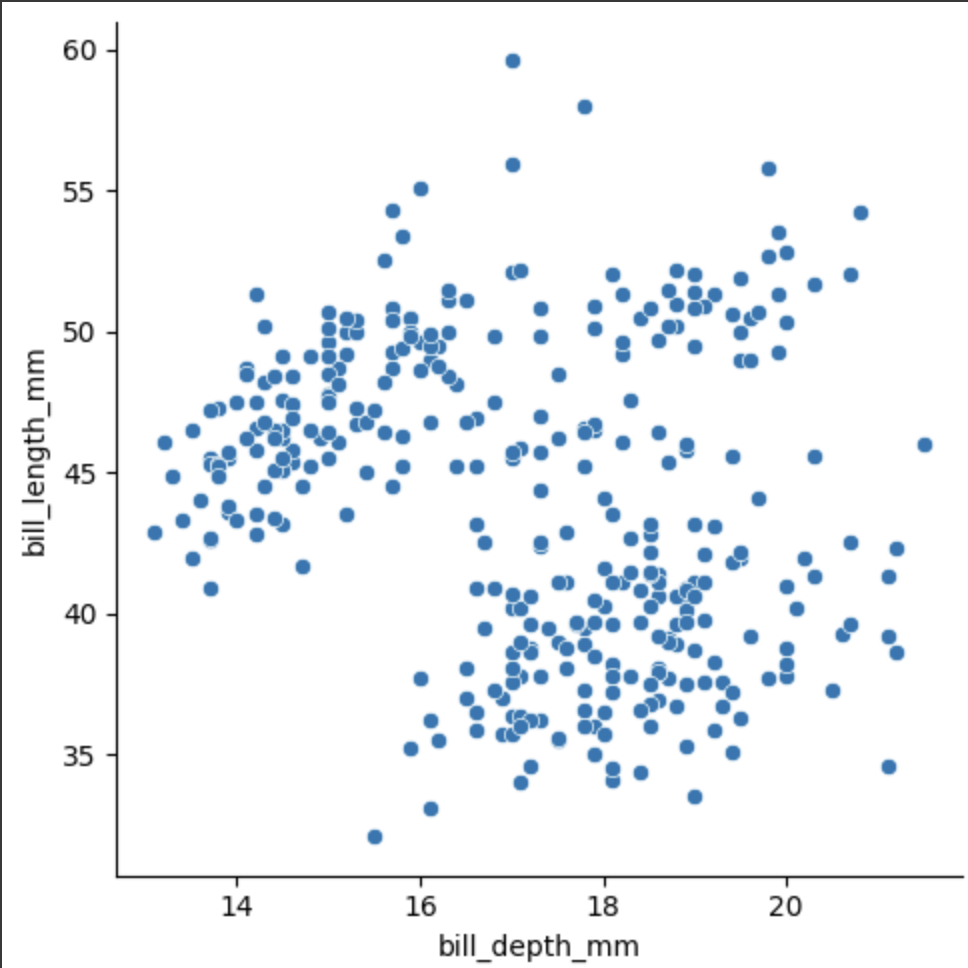
- Gráficos categóricos como box plots, violin plots, bar plots y point plots, que ayudan a visualizar distribuciones y comparaciones de categorías.
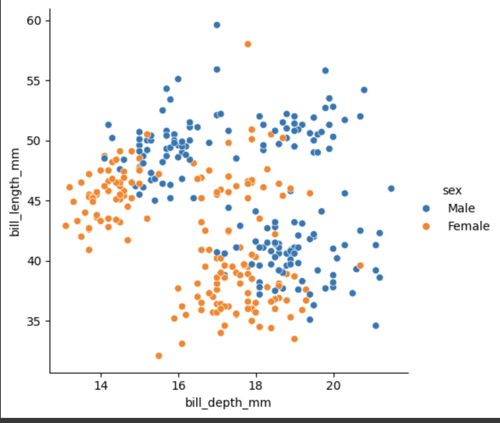
- Gráficos de matriz como heatmaps y clustermaps, que son útiles para explorar correlaciones y agrupaciones.
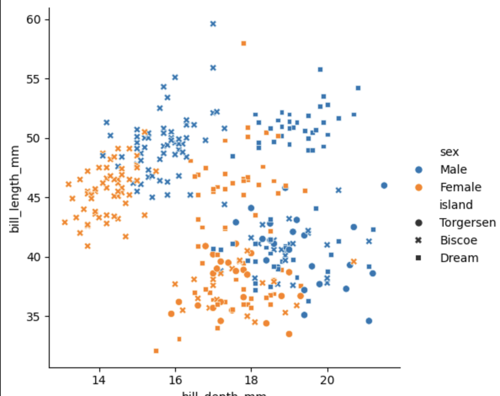
- Gráficos de regresión que facilitan la visualización de modelos lineales en los datos.
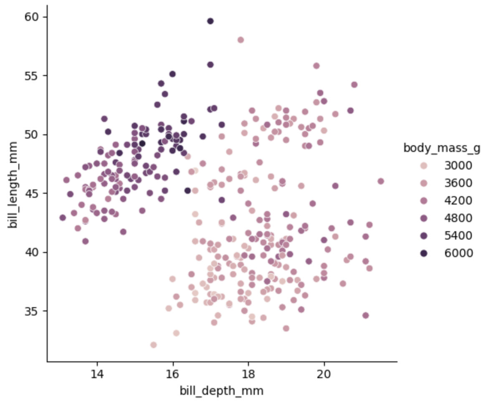


 ### Hablemos de Gráficos de Relación


Los gráficos de relación, comúnmente conocidos como gráficos de dispersión (scatter plots), son herramientas fundamentales en la visualización de datos, usadas principalmente para observar y mostrar relaciones entre dos variables numéricas. Aquí tienes algunos de los usos principales de los gráficos de relación:

    Identificar correlaciones: Uno de los usos más comunes de los gráficos de relación es identificar la existencia y la forma de una correlación entre dos variables. Por ejemplo, podrías utilizar un gráfico de dispersión para determinar si existe una relación lineal entre el tiempo de estudio y las calificaciones obtenidas.

    Detectar patrones o tendencias: Estos gráficos pueden ayudar a visualizar patrones en los datos, como tendencias ascendentes o descendentes, agrupaciones o incluso patrones más complejos que podrían no ser evidentes a simple vista.

    Identificar outliers: Los outliers o valores atípicos son datos que difieren significativamente del resto de los datos. Un gráfico de dispersión puede ayudar a identificar estos puntos, que podrían indicar errores de medición, entradas erróneas o condiciones 

##### Creación un gráfico de relación

2 variables cuantitativas

```
# unverified ssl 
import ssl
ssl._create_default_https_context = ssl._create_unverified_context
## importar la librería -> solo hay que hacerlo una vez
import seaborn as sns
## cargar el set de datos -> solo hay que hacerlo una vez por "rectangulo"
penguins = sns.load_dataset("penguins")

```
- Scatterplot
```
sns.relplot(data=penguins, x="bill_depth_mm", y="bill_length_mm")
```


- Agregando una variable cuali

```
sns.relplot(data=penguins, x="bill_depth_mm", y="bill_length_mm", hue = 'sex')
```


- Agregando dos variables cuali

```
sns.relplot(data=penguins, x="bill_depth_mm", y="bill_length_mm", hue = 'sex', style = 'island' )
```


- Agregando una tercera variable cuanti

```
sns.relplot(data=penguins, x="bill_depth_mm", y="bill_length_mm", hue = 'body_mass_g')
```


- Gráfico de Burbujas

```
sns.relplot(data=penguins, x="bill_depth_mm", y="bill_length_mm", size = 'body_mass_g')
```

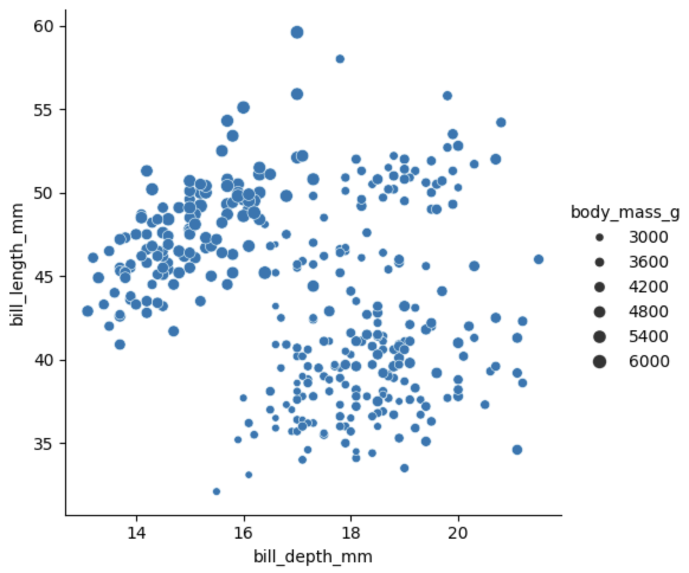


#### Gráficos categoricos

Los gráficos categóricos son una forma visual de representar datos que están categorizados por grupos específicos. Estos gráficos son muy útiles para analizar y comparar datos cualitativos y cuantificativos de una manera clara y efectiva. A continuación, te explico varios tipos de gráficos categóricos y sus usos principales:

- Gráfico de barras: Este es probablemente el tipo más común de gráfico categórico. Los gráficos de barras utilizan barras rectangulares para mostrar las cantidades de cada categoría. Las barras pueden orientarse horizontal o verticalmente. Son ideales para comparar varias categorías en términos de magnitud, frecuencia o cualquier otro indicador numérico.

```
sns.catplot(data=penguins, x="island", y="bill_length_mm", kind="bar")
```

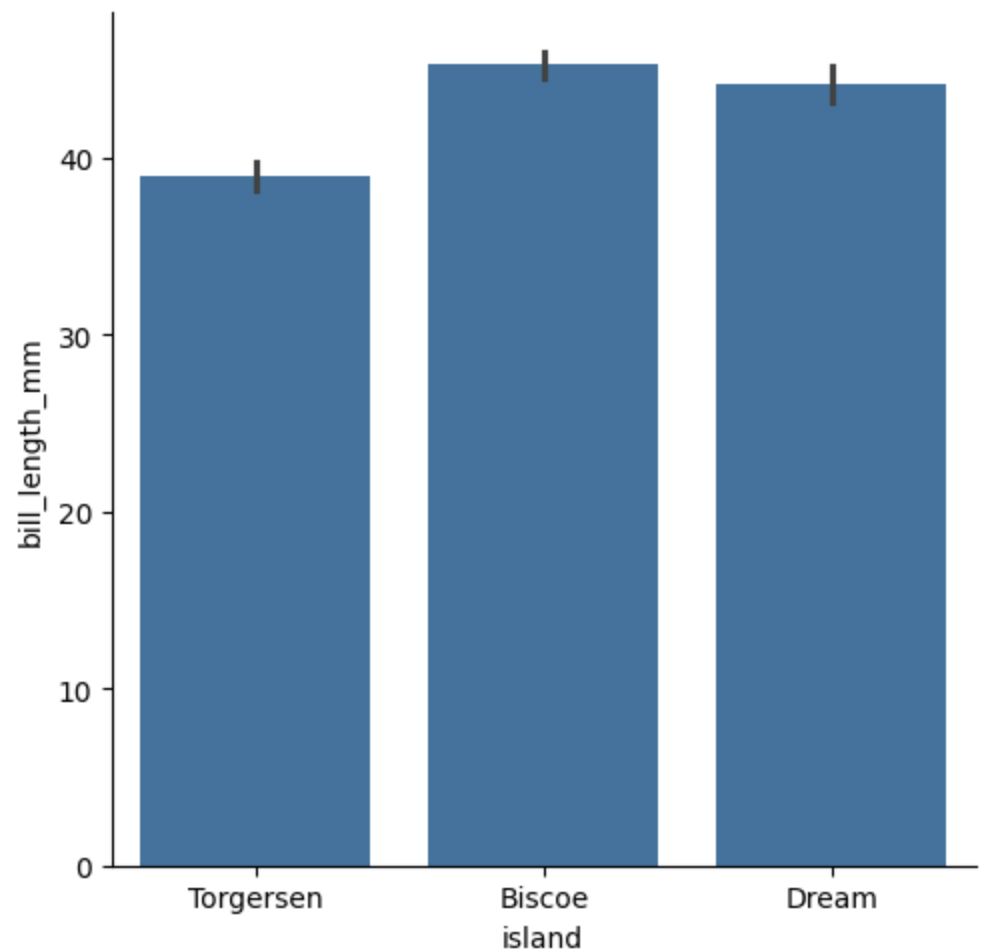

- Gráfico de columnas: Similar al gráfico de barras, pero con las barras colocadas verticalmente. Es útil para comparar datos a través de diferentes categorías y se utiliza a menudo para mostrar cambios en los datos a lo largo del tiempo, si las categorías son intervalos de tiempo.

```
sns.catplot(data=penguins, x="bill_length_mm", y="island", kind="bar")
```

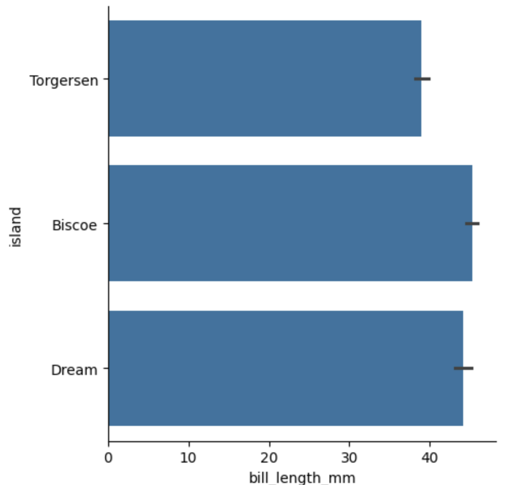

- Gráfico de líneas: En un contexto categórico, un gráfico de líneas puede ser utilizado para mostrar tendencias a lo largo del tiempo (o cualquier otra variable ordinal) para diferentes categorías. Aunque normalmente se asocia con datos temporales, se puede adaptar para mostrar categorías ordinales o incluso nominales si se interpreta correctamente.

```
sns.relplot(data=penguins, x="bill_depth_mm", y="bill_length_mm", hue = 'body_mass_g')
```

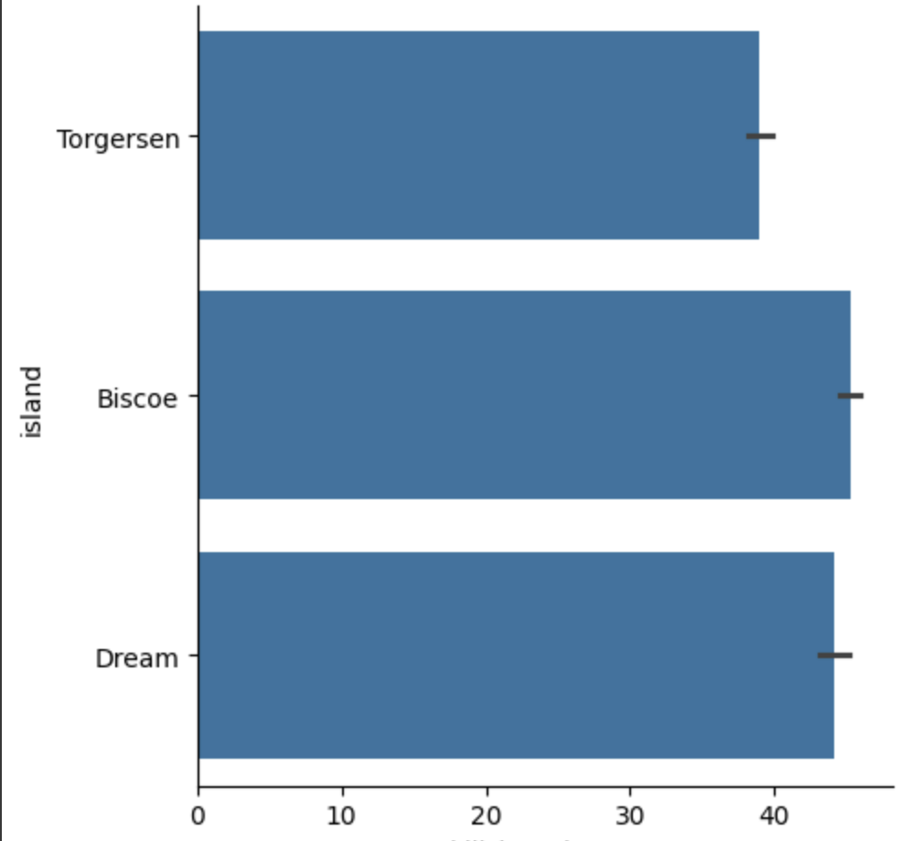

- Diagrama de puntos: También conocido como gráfico de puntos, es efectivo para mostrar la distribución de los datos en categorías, proporcionando una alternativa visual que puede ser menos abarrotada que un gráfico de barras cuando hay muchos datos.

```
sns.catplot(data=penguins, x="island", y="bill_length_mm", kind="swarm")
```

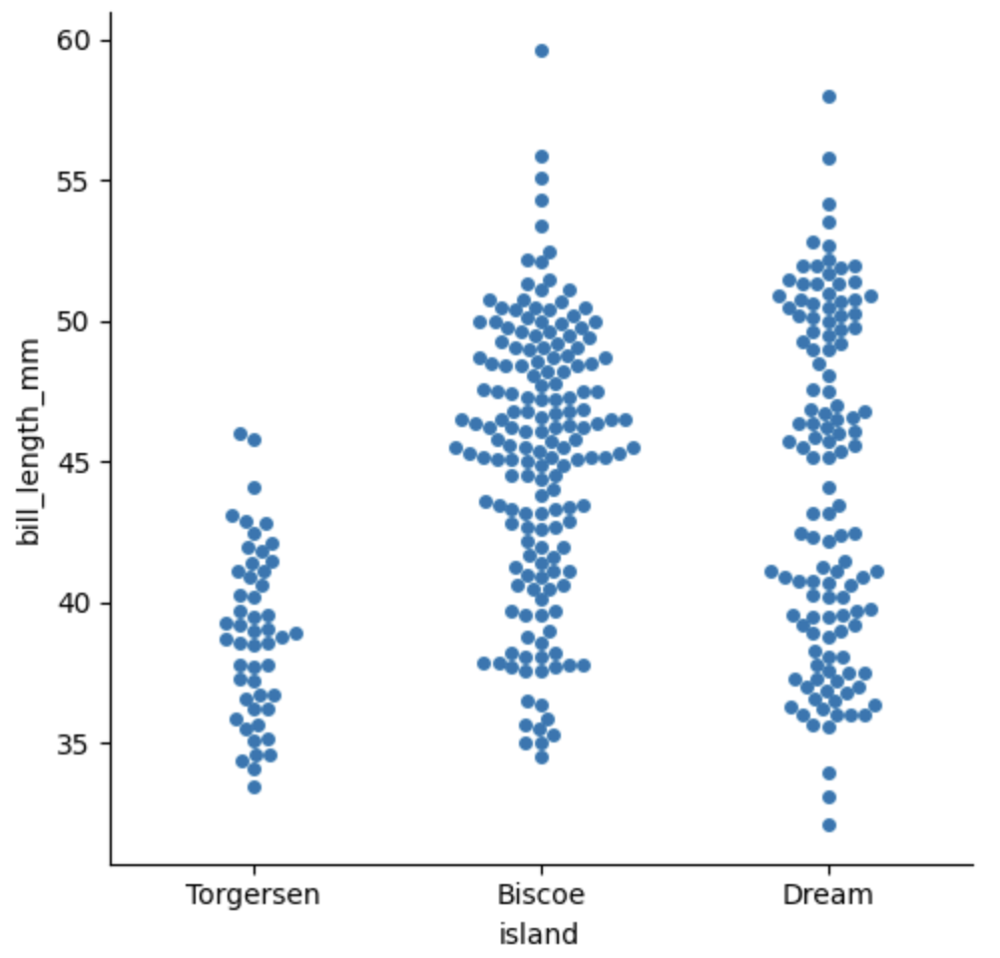


- Diagrama de caja (o box plot): Este gráfico es útil para representar la distribución de los datos cuantitativos a través de categorías, mostrando la mediana, los cuartiles y los valores atípicos. Esto permite comparar rápidamente la dispersión y la centralidad de los datos en diferentes categorías.

```
sns.catplot(data=penguins, x="island", y="bill_length_mm", kind="box")
```

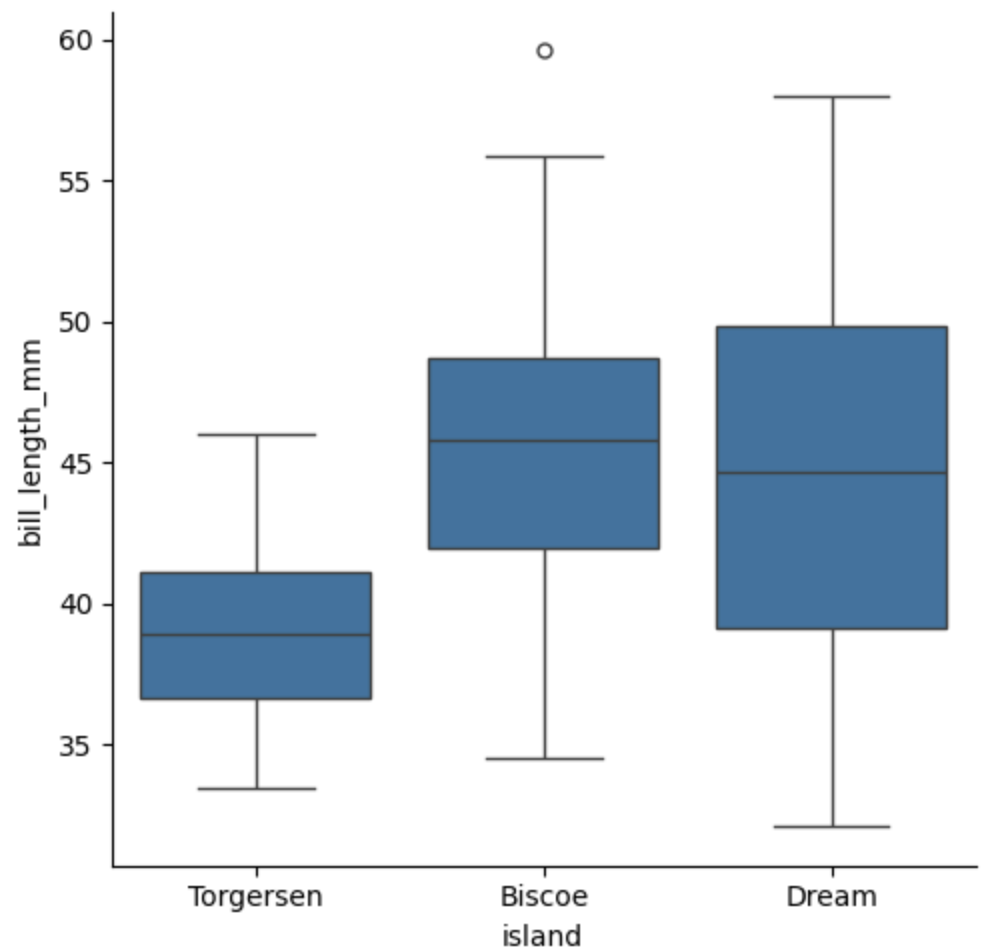


#### Gráficos de Matriz

Los gráficos de matriz son herramientas visuales que permiten analizar múltiples dimensiones de datos y sus interrelaciones a través de una serie de gráficos dispuestos en forma de matriz. Son especialmente útiles para explorar visualmente grandes conjuntos de datos para identificar patrones, correlaciones y anomalías. Aquí te explico los tipos más comunes de gráficos de matriz y sus aplicaciones:

#### Heatmap

```
penguins.dropna(inplace=True)

# Configurar el tamaño de la figura
plt.figure(figsize=(10, 8))
# Seleccionar sólo númericas
numeric_penguins = penguins.select_dtypes(include=[float, int])

# Calculate the correlation matrix
corr = numeric_penguins.corr()

# Crear la heatmap
sns.heatmap(corr, annot=True, cmap='coolwarm', fmt=".2f", linewidths=.5)

# Añadir título y etiquetas si es necesario
plt.title('Correlation Matrix of Penguin Dataset Features')
plt.show()
```

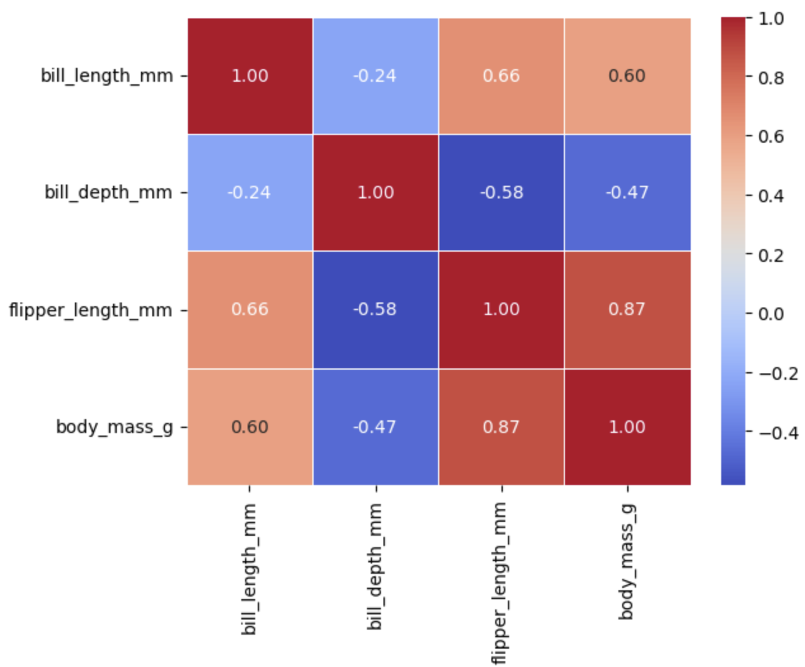

#### SurfacePlot


```
# Preparar datos: vamos a usar 'bill_length_mm', 'bill_depth_mm' y 'body_mass_g'
penguins.dropna(subset=['bill_length_mm', 'bill_depth_mm', 'body_mass_g'], inplace=True)
x = penguins['bill_length_mm']
y = penguins['bill_depth_mm']
z = penguins['body_mass_g']

# Crear una malla de puntos
x, y = np.meshgrid(np.linspace(x.min(), x.max(), len(x.unique())), 
                   np.linspace(y.min(), y.max(), len(y.unique())))

# Ajustar una superficie: z = f(x, y)
# Por simplicidad, usaremos una interpolación lineal aquí para los valores de z
from scipy.interpolate import griddata
z = griddata((penguins['bill_length_mm'], penguins['bill_depth_mm']), penguins['body_mass_g'], (x, y), method='linear')

# Crear la figura y el eje para un gráfico 3D
fig = plt.figure()
ax = fig.add_subplot(111, projection='3d')

# Dibujar el gráfico de superficie
surf = ax.plot_surface(x, y, z, cmap='viridis')

# Añadir una barra de color que mapea los valores a colores
fig.colorbar(surf)

plt.title('Surface Plot of Penguins')
plt.xlabel('Bill Length (mm)')
plt.ylabel('Bill Depth (mm)')
ax.set_zlabel('Body Mass (g)')
plt.show()
```
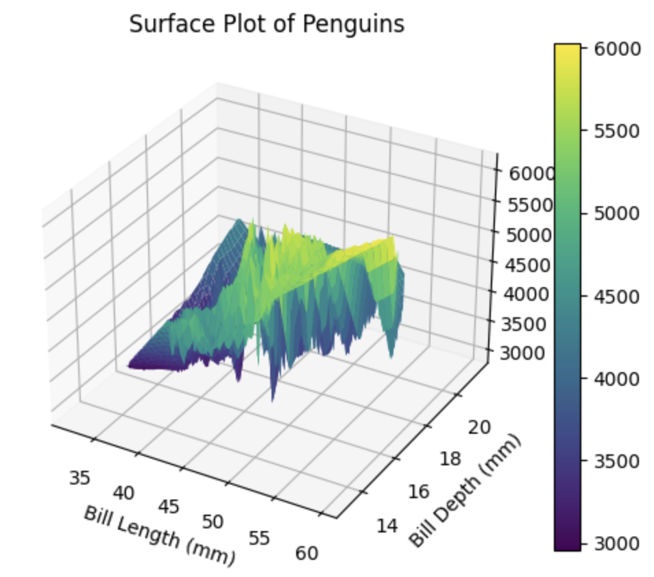

#### Gráficos de Regresión

Los gráficos de regresión son una herramienta esencial en la visualización de datos para analizar la relación entre dos o más variables. Generalmente, se utilizan para entender cómo la variación en una variable independiente puede afectar a una variable dependiente. Este tipo de gráficos es fundamental en el análisis estadístico y la modelización predictiva, ofreciendo una forma visual de identificar tendencias, hacer predicciones y validar suposiciones estadísticas

Los gráficos de regresión no solo son fundamentales para ver relaciones y hacer predicciones, sino que también ayudan a diagnosticar la adecuación de un modelo estadístico. Por ejemplo, los residuos (las diferencias entre los valores observados y los valores predichos por el modelo) pueden ser visualizados para detectar patrones que el modelo no ha capturado, indicando posibles problemas como heterocedasticidad o no linealidad.

En resumen, los gráficos de regresión son herramientas vitales en muchas áreas de investigación y análisis de datos, proporcionando una manera clara y efectiva de entender y predecir comportamientos y tendencias.


```
sns.regplot(x="bill_length_mm", y="bill_depth_mm", data=penguins);
```

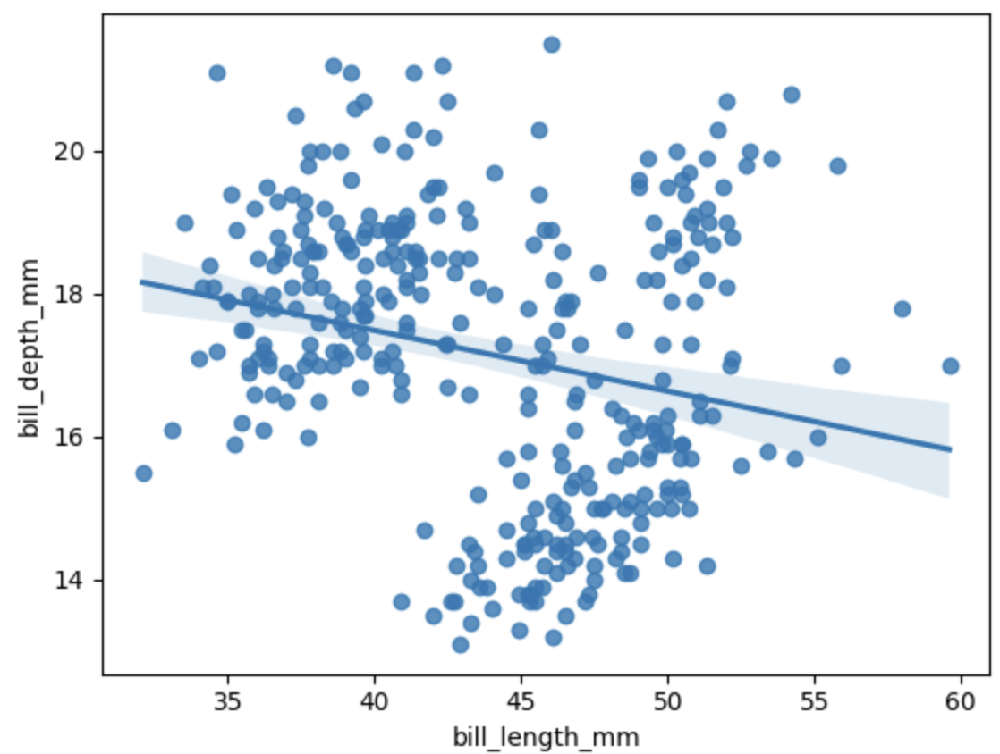

```
sns.regplot(x="bill_length_mm", y="bill_depth_mm", lowess=True, data=penguins)
```

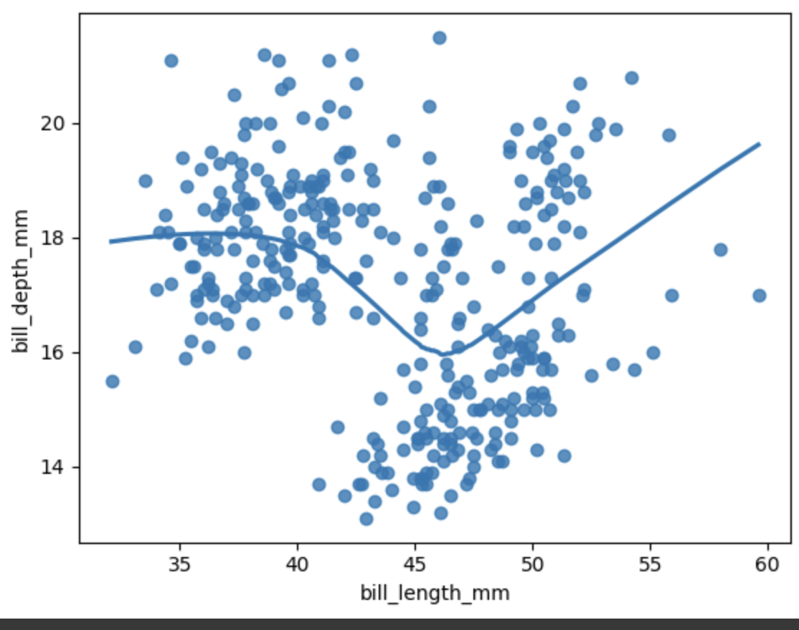


