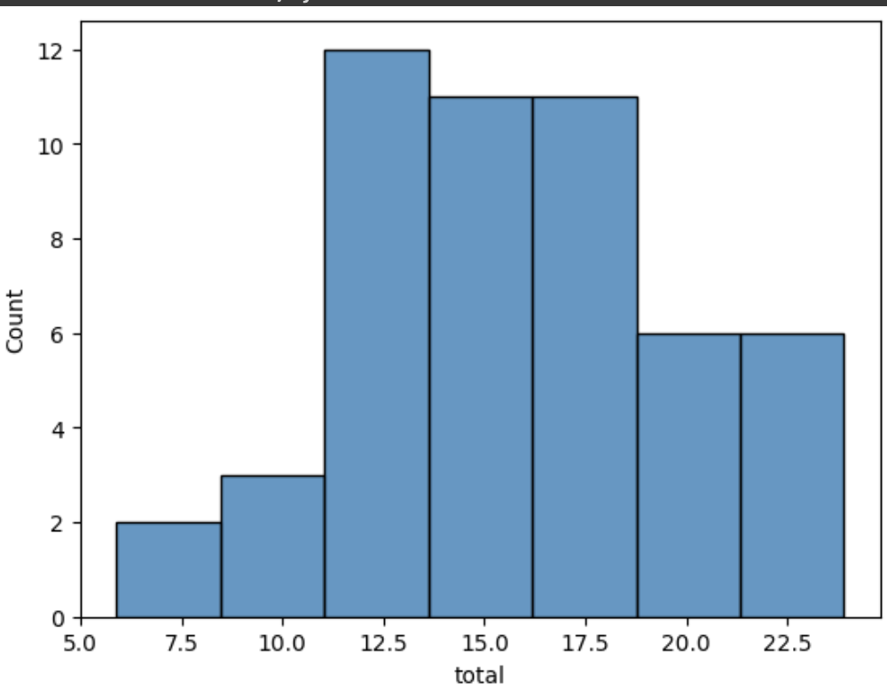
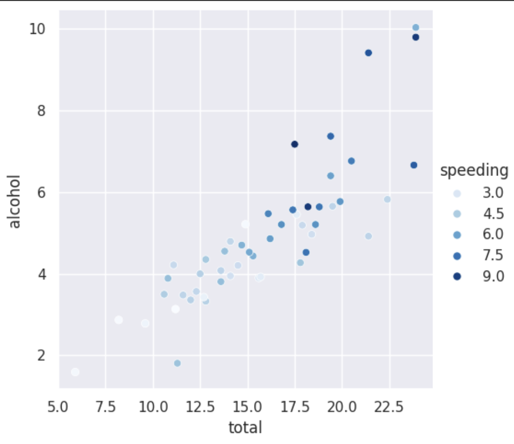
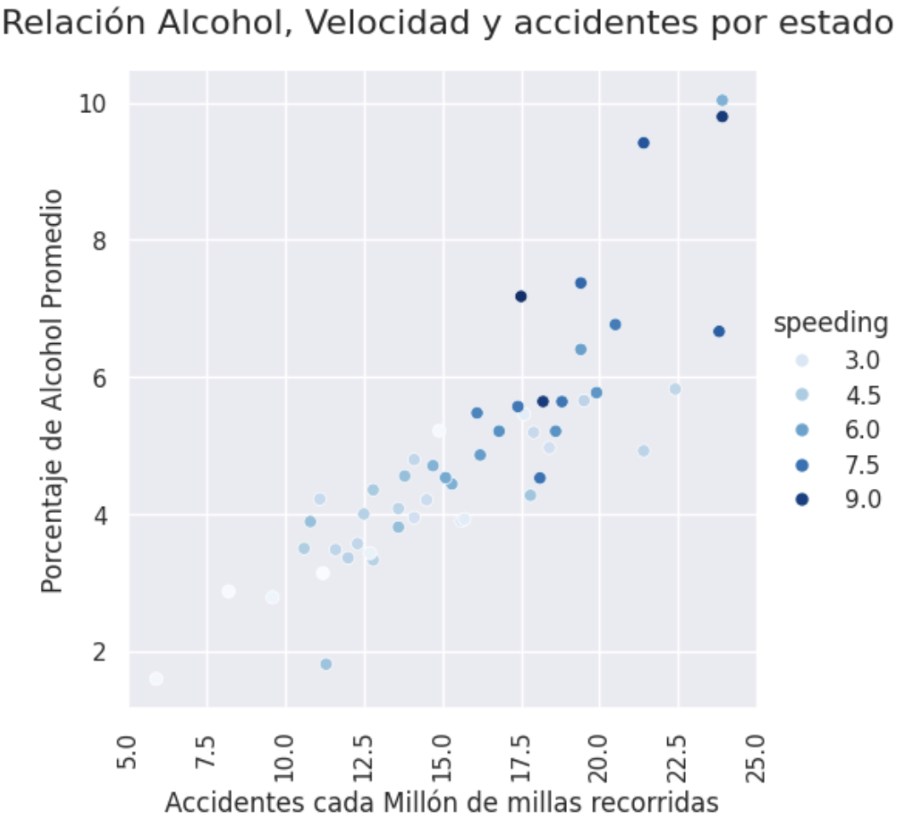

# Semana 8

## Gráficos y más gráficos


#### Tabla de Contenido
- [Objetivo Semanal](#sección-1)
- [Metas Semanales](#sección-2)
- [Sobre la Entrega 4](#sección-3)
- [Gráficos](#sección-4)


	
### 📈[Objetivo Semanal](#sección-1)

- Editar las propiedades de los gráficos para adaptarlos para diferentes necesidades

### 📗[Metas Semanales](#sección-2)

 - [ ] Utilizar los párametros gráficos de la creación de figuras y tablas para permitir su uso en diferentes contextos


### 📈[Sobre la Entrega 4](#sección-3)

- Horario de atención -> Miercoles de 13 a 17, por favor reservar por Calendly
- La otra semana, horas colectivas -> Escoger entre todos

### 📊[Gráficos](#sección-4)

> LO IMPORTANTE NO ES SABERSELAS TODAS, ES SABER A QUIÉN LLAMAR EN CASO DE QUE ALGO PASE - Les Luthiers

- Para ejecutar en Colab, para traer base de datos

```
# unverified ssl 
import ssl
ssl._create_default_https_context = ssl._create_unverified_context
## importar la librería -> solo hay que hacerlo una vez
import seaborn as sns
## cargar el set de datos -> solo hay que hacerlo una vez por "rectangulo"
car_crash = sns.load_dataset("car_crashes")
```

- Base de datos sobre accid4entes

```
## ¿Cómo se ve car_crash?
car_crash.head()
```

El dataset de "car crashes" en Seaborn contiene datos sobre accidentes automovilísticos en los Estados Unidos. Este dataset incluye diversas variables que reflejan aspectos de los accidentes de tráfico a nivel estatal. Es útil para realizar análisis estadísticos y visualizaciones relacionadas con la seguridad vial y las características de los accidentes.

Aquí están las variables incluidas en el dataset:

-  total: Número total de accidentes por cada 100 millones de millas recorridas.
- speeding: Porcentaje de accidentes que involucran exceso de velocidad.
- alcohol: Porcentaje de accidentes que involucran el consumo de alcohol.
- not_distracted: Porcentaje de conductores no distraídos.
- no_previous: Porcentaje de conductores sin accidentes previos.
- ins_premium: Prima de seguro promedio en cada estado (en USD).
- ins_losses: Pérdidas por seguro promedio en cada estado (en USD).
- abbrev: Abreviatura de cada estado.


```
## ¿Cómo se ve car_crash?
car_crash.head()
```

```
## Feeling de las variables
sns.histplot(data=car_crash,x='total')
```


#### Parametros globales - Cambiar los párametros gráficos de los datos

- Párametros globales default

```
sns.set_theme()
sns.histplot(data=car_crash,x='total')
```

```
sns.set_theme(style="whitegrid", palette="pastel")
sns.histplot(data=car_crash,x='total')
```

```
sns.set_theme(style="dark", palette="pastel")
sns.histplot(data=car_crash,x='total')
```
### Colores

- Saturación -> Que tan colorido es cada color
- Tono *hue* -> Que tan diferentes son cada color uno de otro

- Saturación es maravilloso para jugar con cuantitativo
- Tono es maravillo para jugar con variables cualitativas

```
sns.relplot(data=car_crash,x='total',y='alcohol', hue  = 'speeding')
```
```
sns.relplot(data=car_crash,x='total',y='alcohol', hue  = 'mako')
```

```
sns.relplot(data=car_crash,x='total',y='alcohol', hue  = 'Blues')
```




### Agregar titulos, ejes y parametros gráficos

```
g = sns.relplot(data=car_crash,x='total',y='alcohol', hue  = 'speeding', palette='Blues')
# Ajustar el layout
g.set_xticklabels(rotation=90)
g.set_axis_labels("Accidentes cada Millón de millas recorridas", "Porcentaje de Alcohol Promedio")

# Agregar un título general para el FacetGrid
g.fig.suptitle("Relación Alcohol, Velocidad y accidentes por estado", fontsize=16, y=1.05)

# Mostrar el gráfico
plt.show()

```


```
g = sns.relplot(data=car_crash,x='total',y='alcohol', hue  = 'speeding', palette='Blues')
# Ajustar el layout
g.set_xticklabels(rotation=90)
g.set_axis_labels("Accidentes cada Millón de millas recorridas", "Porcentaje de Alcohol Promedio")

# Agregar un título general para el FacetGrid
g.fig.suptitle("Relación Alcohol, Velocidad y accidentes por estado", fontsize=16, y=1.05)

# Cambiar el título de la leyenda (si hay una leyenda)
g._legend.set_title('Speeding')

# Mostrar el gráfico
plt.show()

```