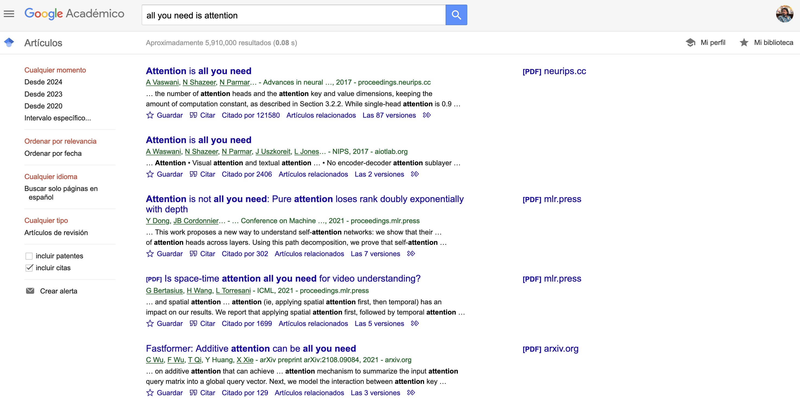
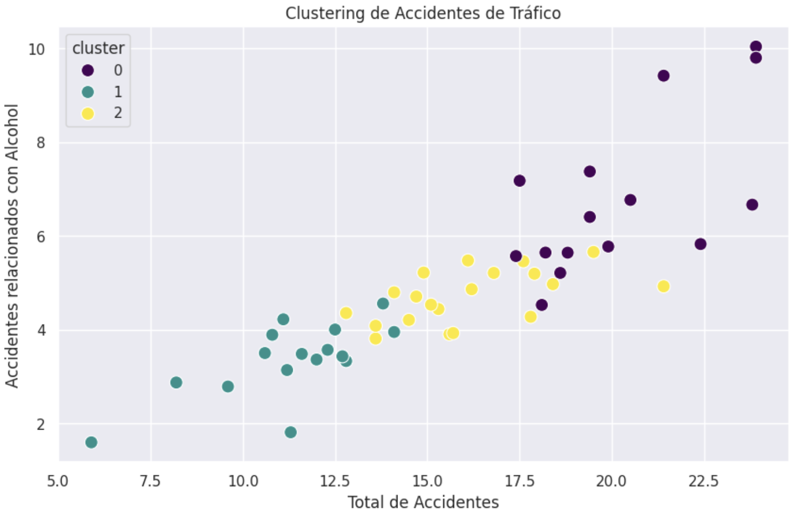
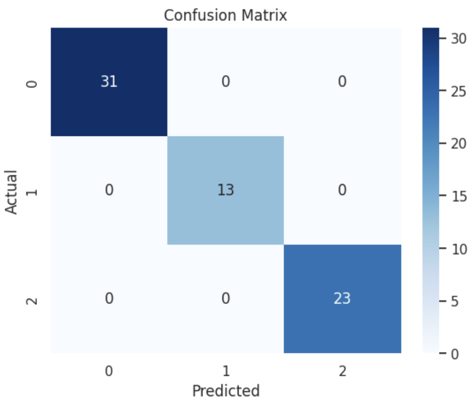

# Semana 8

## Aprendizaje Éstadistico e Inteligencia Artificial


#### Tabla de Contenido
- [Objetivo Semanal](#sección-1)
- [Metas Semanales](#sección-2)
- [Sobre la Entrega 4](#sección-3)
- [ML](#sección-4)
- [Primer Modelo de ML](#sección-5)
- [AI](#sección-5)
- [Primer Modelo de AI](#sección-6)

	
### 📈[Objetivo Semanal](#sección-1)

- Editar las propiedades de los gráficos para adaptarlos para diferentes necesidades tanto profesionales como acádemicas
- Desarrollar una intuición sobre de los campos computacionales mas importantes en el momento

### 📗[Metas Semanales](#sección-2)

 - [ ] Utilizar los párametros gráficos de la creación de figuras y tablas para permitir su uso en diferentes contextos.
 - [ ] Poder desarrollar una conversación critica sobre la inteligencia artificial y el machine learning


### 📈[Sobre la Entrega 4](#sección-3)

- Horario de atención -> Miercoles en la tarde, compartiré horario colectivo
- Dentro de 8 días, espero esas entregas en git

### 📊[¿Qué es Machine Learning?](#sección-4)

#### Varianza vs Sesgo, Variables Cualitativas vs Variables Cuantitativas


- ¿Cómo sabe spotify, apple music o youtube que después de escuchar Karol G problablemente quiero escuchar Mora y no Morat?

- ¿Cómo logra Google enviarme papers relacionados con el tema oscuro y arcano de mi elección?



Un compañero de la clase me pregunta cómo se construye una variable cualitativa si solo tenemos variables cuantitativas en nuestro conjunto de datos. ¿La pregunta es si existe tal cosa cómo una variable cualitativa propiamente dicha? Vivimos en un mundo n-dimensional, la pregunta es que tanto las n-dimensiones aportan a nuestra comprensión de mundo. 

- Ejemplo de la altura: 1.80, altos y bajos
- Ejemplo de la popularidad en el número de followers - n, o muchos o pocos
- ¿Cuanto mide la fachada de la torre Colpatria? un mucho, 76 pisos, o n mm


La reducción de la dimensionalidad es una técnica en analisis computacional que se utiliza para simplificar conjuntos de datos de alta dimensión mientras se conserva la mayor cantidad de información relevante posible. Este proceso es crucial porque trabajar con datos de muchas dimensiones (también conocido como el problema de la "maldición de la dimensionalidad") puede ser complicado y computacionalmente costoso. Además, los datos de alta dimensión a menudo contienen redundancias o características irrelevantes que pueden afectar negativamente el rendimiento de los algoritmos.


El Machine Learning (aprendizaje automático) es una rama de interdisciplinar entre las mátematicas, las ciencias computacionales y la estadistica que se centra en el desarrollo de algoritmos y técnicas que permiten a las computadoras aprender y hacer predicciones o tomar decisiones basadas en datos. En lugar de seguir instrucciones explícitas para realizar tareas, los sistemas de machine learning utilizan datos para identificar patrones y hacer inferencias, mejorando su rendimiento a medida que se les proporciona más información. Usualmente se tienen dos objetivos: *Clasificar* y *Predecir*


*Ejemplos de Machine Learning*:

-  Reconocimiento de Voz:
        Asistentes virtuales como Siri, Google Assistant y Alexa utilizan machine learning para reconocer y procesar el lenguaje hablado, entendiendo y respondiendo a las consultas de los usuarios.

- Filtrado de Spam:
        Los servicios de correo electrónico como Gmail usan algoritmos de machine learning para identificar y filtrar correos electrónicos no deseados (spam) basándose en características del contenido y patrones históricos.

- Sistemas de Recomendación:
        Plataformas como Netflix, Amazon y Spotify emplean machine learning para recomendar películas, productos o música a los usuarios, analizando sus preferencias y comportamientos anteriores.

- Detección de Fraude:
        Las instituciones financieras utilizan machine learning para detectar actividades fraudulentas en tiempo real, analizando transacciones y señalando aquellas que parecen sospechosas.

- Diagnóstico Médico:
        Herramientas de machine learning ayudan a los médicos a diagnosticar enfermedades, como el cáncer, al analizar imágenes médicas y datos de pacientes, identificando patrones que pueden indicar la presencia de enfermedades.

- Conducción Autónoma:
        Los vehículos autónomos, como los desarrollados por Tesla y Waymo, utilizan machine learning para interpretar datos de sensores y cámaras, permitiendo que el vehículo navegue y tome decisiones de conducción en tiempo real.

- Reconocimiento de Imágenes:
        Aplicaciones de redes sociales como Facebook y Instagram usan machine learning para reconocer y etiquetar personas en fotos, mejorando la experiencia del usuario al gestionar y buscar imágenes.

### Tipos de Machine Learning:

- *Aprendizaje Supervisado* :
        El sistema aprende a partir de un conjunto de datos etiquetados, es decir, cada entrada de datos tiene una respuesta conocida. Ejemplo: Clasificación de correos electrónicos como spam o no spam.

    Regresión Lineal:
        Se utiliza para predecir valores continuos. Encuentra la relación lineal entre las variables independientes y la variable dependiente.
        Ejemplo: Predecir el precio de una casa basado en características como tamaño, ubicación, etc.

    Regresión Logística:
        Se utiliza para predecir probabilidades y clasificaciones binarias (dos clases). Es una extensión de la regresión lineal para problemas de clasificación.
        Ejemplo: Predecir si un correo electrónico es spam o no.

    Árboles de Decisión:
        Modelos que utilizan una estructura de árbol para tomar decisiones basadas en reglas derivadas de las características de los datos.
        Ejemplo: Clasificar el tipo de planta basándose en características de sus hojas.

    Bosques Aleatorios (Random Forests):
        Conjunto de árboles de decisión que trabajan juntos para mejorar la precisión y evitar el sobreajuste.
        Ejemplo: Predicción de enfermedades basándose en síntomas.

    Máquinas de Vectores de Soporte (SVM):
        Modelos que buscan encontrar el hiperplano que mejor separa las clases en el espacio de características.
        Ejemplo: Clasificación de imágenes en categorías.

    Redes Neuronales Artificiales (ANN):
        Modelos inspirados en el cerebro humano, compuestos por capas de neuronas que procesan la información.
        Ejemplo: Reconocimiento de patrones en datos complejos como imágenes o voz.

- *Aprendizaje No Supervisado*:
        El sistema intenta identificar patrones y relaciones en datos sin etiquetas. Ejemplo: Agrupación de clientes en diferentes segmentos basándose en su comportamiento de compra.

    K-Means:
        Algoritmo de clustering que agrupa los datos en k clusters basados en la proximidad de las características.
        Ejemplo: Segmentación de clientes en marketing.

    Clustering Jerárquico:
        Crea una jerarquía de clusters mediante la combinación de los datos en clusters cada vez más grandes.
        Ejemplo: Agrupación de especies animales basándose en similitudes genéticas.

    Algoritmos de Asociación:
        Encuentran relaciones interesantes (reglas de asociación) entre variables en grandes conjuntos de datos.
        Ejemplo: Análisis de la cesta de la compra para encontrar productos que se compran juntos.

    Análisis de Componentes Principales (PCA):
        Técnica de reducción de dimensionalidad que transforma los datos a un nuevo espacio de características manteniendo la mayor varianza posible.
        Ejemplo: Compresión de datos de imagen para reducir el tamaño de almacenamiento.

    Autoencoders:
        Redes neuronales utilizadas para aprender una representación compacta de los datos, generalmente para reducción de dimensionalidad o detección de anomalías.
        Ejemplo: Reducción de ruido en imágenes.

- *Aprendizaje por Refuerzo*:
        El sistema aprende mediante prueba y error, tomando decisiones y recibiendo recompensas o penalizaciones según el resultado de esas decisiones. Ejemplo: Algoritmos que juegan videojuegos o sistemas de trading en el mercado de valores.
    
    Q-Learning:

        Algoritmo basado en la tabla de valores Q que guía a un agente a tomar acciones en un entorno para maximizar la recompensa.
    Ejemplo: Un robot aprendiendo a navegar en un laberinto.

    Deep Q-Networks (DQN):

    Extensión del Q-Learning que utiliza redes neuronales profundas para aproximar la función Q.
        Ejemplo: Un agente de IA aprendiendo a jugar videojuegos.

    Métodos de Política:

    Algoritmos que optimizan directamente la política de acciones en lugar de la función de valor.
        Ejemplo: Optimización de la política de decisiones en juegos de mesa complejos.


### 😎 [Primer Modelo de ML](#sección-5)

##### Pasos para realizar el clustering

1. Cargar el dataset y las librerías necesarias.
2. Explorar y preprocesar los datos.
3. Aplicar el modelo de clustering (K-Means).
4. Visualizar los resultados.

```
import seaborn as sns
import pandas as pd
import matplotlib.pyplot as plt
from sklearn.cluster import KMeans
from sklearn.preprocessing import StandardScaler

# Cargar el dataset de seaborn
df = sns.load_dataset('car_crashes')

# Mostrar las primeras filas del dataset
df.head()
```

##### Exploración y preprocesamiento de datos

Revisamos las columnas disponibles y seleccionamos aquellas que nos parecen relevantes para el clustering. En este caso, seleccionaremos algunas columnas numéricas relacionadas con los accidentes de tráfico.

```
 Seleccionar características relevantes
features = df[['total', 'speeding', 'alcohol', 'not_distracted', 'no_previous']]

# Estandarizar las características
scaler = StandardScaler()
scaled_features = scaler.fit_transform(features)

# Convertir de nuevo a un DataFrame para mejor manejo
scaled_df = pd.DataFrame(scaled_features, columns=features.columns)

# Mostrar las primeras filas del dataset escalado
scaled_df.head()
```

##### Aplicar el modelo de clustering (K-Means)

```
# Definir el número de clusters
n_clusters = 3

# Crear el modelo K-Means
kmeans = KMeans(n_clusters=n_clusters, random_state=42)

# Ajustar el modelo a los datos escalados
kmeans.fit(scaled_df)

# Añadir las etiquetas de los clusters al DataFrame original
df['cluster'] = kmeans.labels_

# Mostrar las primeras filas del DataFrame con las etiquetas de los clusters
df.head()
```


##### Aplicar el modelo de clustering (K-Means)

Podemos visualizar los clusters en un gráfico para interpretar los resultados. Utilizaremos dos características para crear un scatter plot.

```
# Definir el número de clusters
n_clusters = 3

# Crear el modelo K-Means
kmeans = KMeans(n_clusters=n_clusters, random_state=42)

# Ajustar el modelo a los datos escalados
kmeans.fit(scaled_df)

# Añadir las etiquetas de los clusters al DataFrame original
df['cluster'] = kmeans.labels_

# Mostrar las primeras filas del DataFrame con las etiquetas de los clusters
df.head()
```

### Pintarlo

```
sns.set_theme()

# Visualizar los clusters utilizando Seaborn
plt.figure(figsize=(10, 6))

# Crear el scatter plot con Seaborn
sns.scatterplot(data=df, x='total', y='alcohol', hue='cluster', palette='viridis', s=100)

# Añadir títulos y etiquetas
plt.title('Clustering de Accidentes de Tráfico')
plt.xlabel('Total de Accidentes')
plt.ylabel('Accidentes relacionados con Alcohol')

# Mostrar el gráfico
plt.show()
```


### 🥋[¿Qué es AI?](#sección-5)

La Inteligencia Artificial (IA) es una rama de la informática que se enfoca en crear sistemas capaces de realizar tareas que normalmente requieren inteligencia humana. Esto incluye capacidades como el aprendizaje, la percepción, el razonamiento, la comprensión del lenguaje y la toma de decisiones. Los sistemas de IA utilizan diversos algoritmos y modelos matemáticos para procesar datos, aprender de ellos y realizar acciones basadas en esa información.

Tipos de IA:

- IA Débil (Narrow AI):
        Diseñada para realizar una tarea específica. Ejemplos incluyen asistentes virtuales como Siri y sistemas de recomendación como los de Netflix.

- IA Fuerte (General AI):
        Tiene la capacidad de realizar cualquier tarea intelectual que un ser humano pueda hacer. Este tipo de IA aún está en desarrollo y no existe actualmente.

- Superinteligencia:
        Una inteligencia que supera con creces a la humana en todos los aspectos. Este es un concepto teórico y futurista.

Redes Neuronales

Las redes neuronales son un conjunto de algoritmos inspirados en el funcionamiento del cerebro humano, diseñados para reconocer patrones y aprender de los datos. Son una parte fundamental del aprendizaje automático (Machine Learning) y del aprendizaje profundo (Deep Learning)

##### Ejemplo de Aplicación

Un ejemplo práctico de una red neuronal es una CNN utilizada para el reconocimiento de imágenes. Supongamos que queremos entrenar una CNN para reconocer dígitos escritos a mano (como en el dataset MNIST). La red toma una imagen de un dígito, pasa por varias capas convolucionales y de pooling, y finalmente una capa completamente conectada produce la probabilidad de cada dígito del 0 al 9. A través del proceso de entrenamiento, la red ajusta sus pesos y sesgos para minimizar el error en las predicciones, aprendiendo a identificar características clave de los dígitos.

En resumen, la IA es un campo amplio que abarca muchas técnicas y aplicaciones, mientras que las redes neuronales son un enfoque específico dentro de la IA que se utiliza para modelar y resolver problemas complejos de aprendizaje automático.

Modelo para nuestro set de datos de penguinos -> Podemos predecir la especie si tenemos las caracteristicas morfologicas del pinguino?

```
import seaborn as sns
import pandas as pd
import matplotlib.pyplot as plt
from sklearn.model_selection import train_test_split
from sklearn.linear_model import LogisticRegression
from sklearn.metrics import classification_report, confusion_matrix
from sklearn.preprocessing import StandardScaler

# Cargar el dataset de seaborn
df = sns.load_dataset('penguins')

# Eliminar filas con valores nulos
df = df.dropna()

# Convertir la variable categórica 'species' a valores numéricos
df['species'] = df['species'].astype('category').cat.codes

# Seleccionar características relevantes
features = ['bill_length_mm', 'bill_depth_mm', 'flipper_length_mm', 'body_mass_g']
X = df[features]
y = df['species']

# Estandarizar las características
scaler = StandardScaler()
X = scaler.fit_transform(X)

# Dividir los datos en conjuntos de entrenamiento y prueba
X_train, X_test, y_train, y_test = train_test_split(X, y, test_size=0.2, random_state=42)

# Crear el modelo de regresión logística
model = LogisticRegression()

# Entrenar el modelo
model.fit(X_train, y_train)

# Predecir en el conjunto de prueba
y_pred = model.predict(X_test)

# Evaluar el modelo utilizando un reporte de clasificación y una matriz de confusión
print("Classification Report:")
print(classification_report(y_test, y_pred))

print("Confusion Matrix:")
print(confusion_matrix(y_test, y_pred))

# Visualizar la matriz de confusión
sns.heatmap(confusion_matrix(y_test, y_pred), annot=True, fmt='d', cmap='Blues')
plt.title('Confusion Matrix')
plt.xlabel('Predicted')
plt.ylabel('Actual')
plt.show()
```

