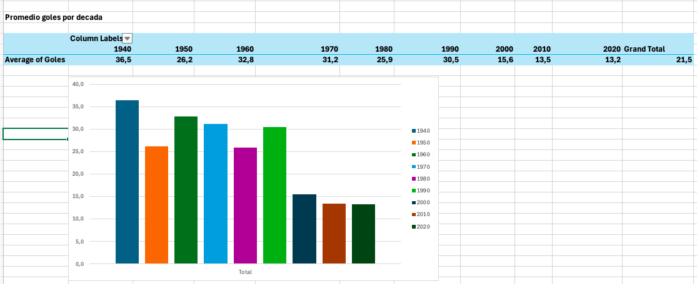
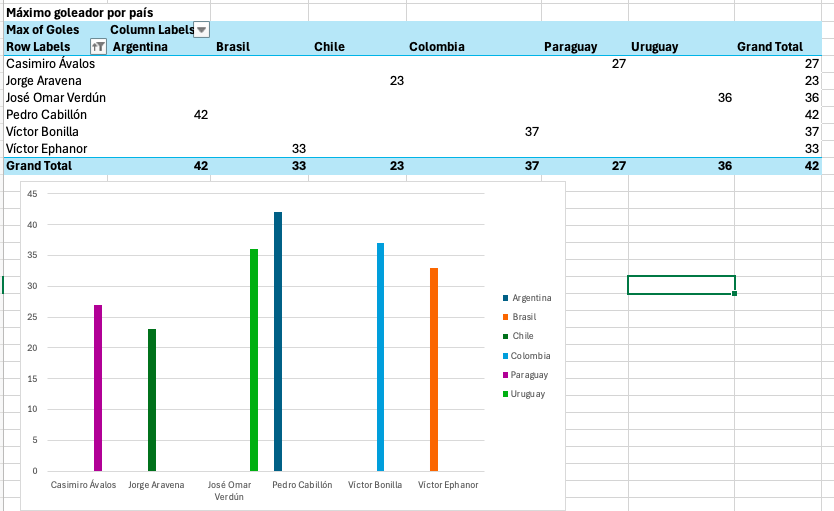
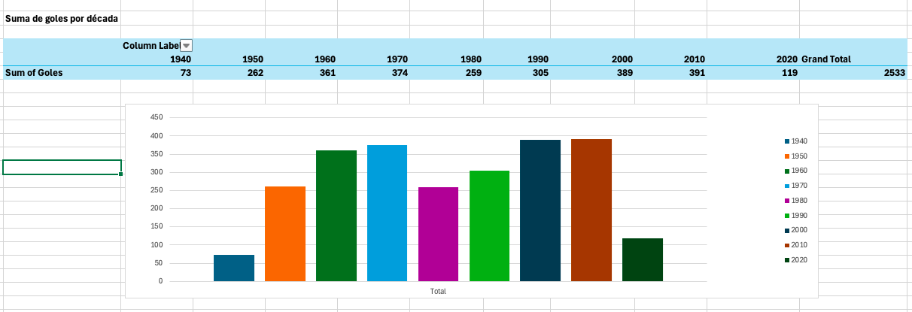
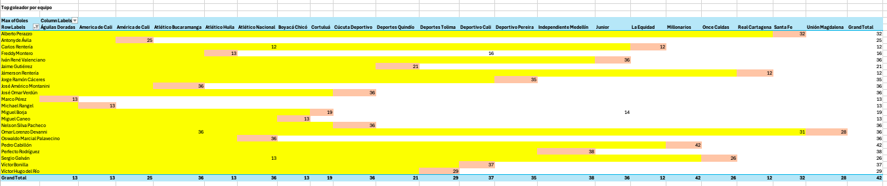
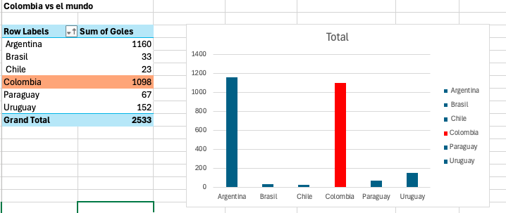
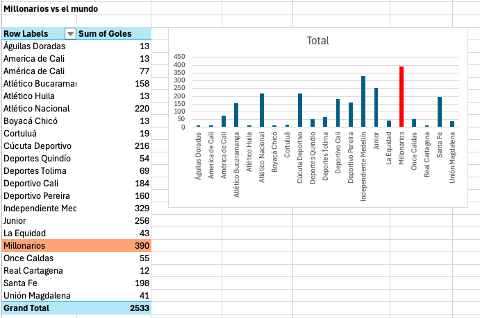
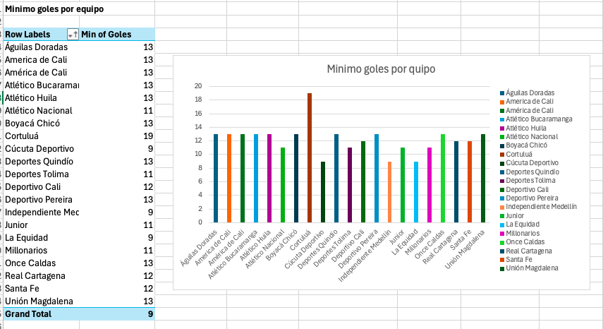
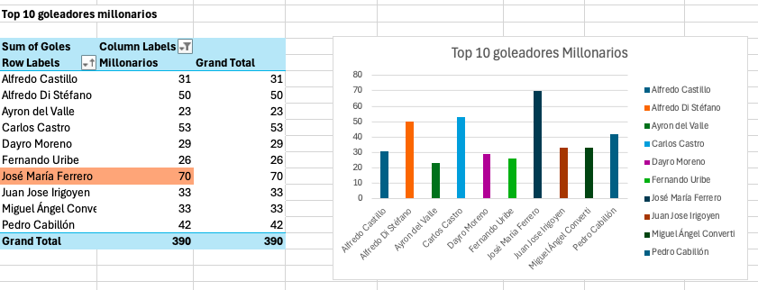
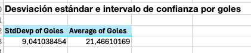

**SofiaBiermannEntregaExcel**

1. Promedio de goles por decada
##se crea la columna  de década en la tabla, no se toma de 1948 a 1958, por ejemplo, sino se toma como década de los 40, 50, y asi sucesivamente, aunque no haya datos de todos los años de la decada. Después se hace una tabla dinámica con la variable década y el valor de goles, a los que se le aplica la fórmula de promedio. El gráfico muestra que ha habido un decrecimiento e el promedio de goles desde la década de 1940 hasta la década del 2010.

3. Maximo goleador por nacionalidad
##Para calcular el maximo goleador por nacionalidad se hizo una tabla dinámica usando como variables el país, y el jugador, y como valor los goles, a los que se le aplicó la fórmula MAX para que solo calculara el máximo de goles. Después se filtró la columna de jugadores para que solo apareciera el máximo goleador por cada país, en lo que se pudo ver que el máximo goleador de Argentina es Pedro Cabillón (42 goles), el máximo goleador de Brasil es Victor Ephanor (33 goles), el máximo de Chile es Jorge Aravena (23 goles), el máximo de Colombia es Victor Bonilla (37 goles), el máximo de Paraguay es Casimiro Ávalos (27 goles) y el máximo de Uruguay es José Omar Verdún (36 goles).

7. Suma de goles por decada
##Para calcular la suma de goles por década se hace una tabla dinámica tomando como variable las décadas, y como valor los goles, aplicando la fórmula SUM. El gráfico muestra que ha habido un crecimiento en la suma de goles en los últimos años, siendo la década de 2010 en la que más se anotaron goles, con un valor de 391. 

13. Top goleador por equipo
##Para calcular el mejor goleador por equipo se hace una tabla dinámica tomando como variables los equipos y los jugadores, y se usa como valor el máximo de goles. Luego se señala en la tabla cuál ha sido el mayor goleador de cada equipo y se filtran los jugadores, de manera que queden solo visibles los jugadores con mayores goles de cada equipo. La tabla permite hacer numerosas interpretaciones, entre ellas, por ejemplo que Pedro Cabillón ha sido mayor goleador, y que, además, Millonarios no ha tenido otro jugador que anote más goles que él. Al mismo tiempo, puede decirse que varios jugadores han sido goleadores en más de un equipo, como Carlos Rentería, Galván y Devanni, pero ningún jugador ha sido máximo goleador en mas de un equipo.

16. Colombia vs el mundo
##Para ver el rendimiento de los jugadores colombianos vs los jugadores de otras nacionalidades, se hace una tabla dinámica con la variable país, y se toma como valor la suma de goles. La tabla permite hacer una comparación entre países, donde se ve que los jugadores colombianos están en segundo lugar, con un total de 1098 goles, y son solo superados por Argentina, con 1160 goles.  

17. Millonarios vs el mundo
##Para ver el rendimiento de millonarios en comparación con otros equipos, se hace una tabla dinámica con la variable equipo, y se toma como valor la suma de goles. La tabla deja ver que Millonarios es el equipo que más goles ha anotado, con un total de 390 goles. 

21. Minimo numero de goles por equipo
##Para ver el mínimo numero de goles que cada equipo ha anotado, se hace una tabla dinámica en con la variable equipo, y se toma como valor los goles, a los que se le aplica la formula mínimo.  La tabla permite ver que los equipos con menos goles son La Equidad, Cúcuta Deportivo e Independiente Medellín. 

22. Maximo de goles por equipo
##Para ver el máximo de goles de cada equipo, se hace una tabla dinámica con la variable equipo, se toma como valor los goles, y se le aplica la formula max. La tabla permite ver que el equis que mas goles ha anotado es Millonarios con 42, seguido de Independiente Medellín con 38 y Deportivo Cali con 37.

34. Top 10 goleadores Millonarios
##Para ver el top 10 de goleadores de millonarios se hace una tabla dinámica en la que se toman como variables los jugadores, y los equipos (que se filtran para ver solo los jugadores de Millonarios). Se toma como valor la suma de goles y se organizan en la tabla de mayor a menor, dejando ver que el mayor goleador de Millonarios ha sido José María Ferrero.

36. Desviación estandar por goles
##Para encontrar la desviación estándar de los goles se usa la fórmula =STDEV. Luego, Para encontrar el intervalo de confianza de los goles se debe obtener el promedio, con la función =AVERAGE, el número de datos con la función =COUNT, y Alfa, que se determina como el 95%, el nivel de confianza que se quiere utilizar

